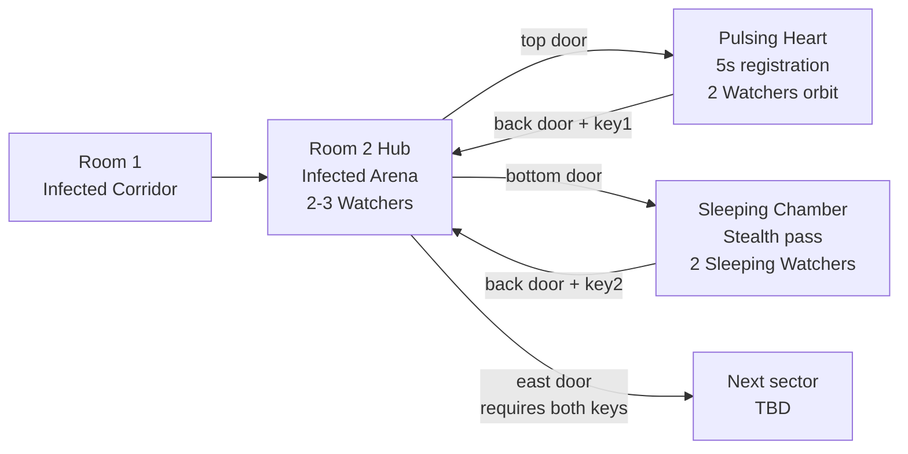

# Infected Sector — Hub + Pulsing Heart + Sleeping Chamber

## Summary

Continuation of Room 1's infected zone — три новых комнаты которые вместе образуют suba-локацию «infected sector». Hub-арена в стиле Room 1 (красные стены, ambient bullets, 2-3 Watcher-а в idle drift) с тремя проходами: top + bottom в side-rooms, east — главная дверь требующая 2 ключа. **Pulsing Heart** (top) — встаёшь в центре hex-структуры на 5 s registration; пульсы сердца работают как LOS-cover пока 2 watcher-а орбитируют. **Sleeping Chamber** (bottom) — тёмная комната, 2 спящих watcher-а; идёшь к ключу не разбудив, walk-mode безопасен, бег/dash будит. Noisy clear Sleeping Chamber (если разбудила) → hub при возврате злее. Доставка staged в 3 sprint-а: Sprint 1 hub + placeholder side-rooms, Sprint 2 Pulsing Heart, Sprint 3 Sleeping Chamber.

---

## Problem Frame

Room 1 (`src/rooms/room1.ts`) — единственная отшлифованная комната в кампании. Все остальные (room2-room5) — тестовые placeholder-ы, которые поломались с Watcher 2.0 (`feat/watcher-redesign` ветка): в открытых аренах нет cover, gaze stack заполняется неминуемо, mark-execute гарантирован. Нужно несколько комнат **спроектированных под** новый Watcher с его LOS-зависимыми механиками.

Параллельно — лор Watcher-а как «зеркало Witness'а» и «снайпер, который видит обратно» сейчас раскрыт только в одной комнате (Tutorial Room 2 с одним watcher-ом). Multi-room sub-локация даёт пространство показать характер этого врага в разных контекстах: hub (он патрулирует), Pulsing Heart (он сторожит ритуал), Sleeping Chamber (он спит и его лучше не будить).

Также — наш player-flow сейчас линейный (room1 → room2 → ... → room5). Hub с тремя выходами вводит первое **branching choice** в кампанию и pattern для stealth-vs-loud trade-offs.

---

## Key Flows

- F1. **Sector entry**
  - **Trigger:** Player completes Room 1 (infected corridor), passes through its door to Room 2 hub.
  - **Steps:**
    1. Player spawns at west of hub. East door visible на дальней стороне с **двумя key-slot indicators** (визуально 0/2).
    2. Top + bottom doors видны (открытые, не требуют ключа).
    3. Hub Watcher-ы в idle drift; ambient bullets бегают. Background text играет infected-sector flavour.
    4. Player выбирает путь — top или bottom.
  - **Outcome:** Player understands "need 2 keys, choose path order" without explicit tutorial.
  - **Covered by:** R1, R2, R3, R4, R5.

- F2. **Pulsing Heart clear**
  - **Trigger:** Player enters top side-room from hub.
  - **Steps:**
    1. Player видит центральную hex-структуру (the heart) и 2 watcher-ов на orbit. Watcher-ы переходят в aggro по обычной awareness logic при entry.
    2. Player движется к центру. Heart пульсирует — каждый пульс расширяется и проходит через orbit radius, давая momentary LOS-cover.
    3. Player стоит в центре registration zone. Progress индикатор (5 s cumulative). Если выходит — pause но не reset.
    4. Через 5 s registration complete → heart разделяется/успокаивается → key materializes.
    5. Player забирает ключ → возвращается через back-door в hub.
  - **Outcome:** Pulsing Heart cleared, 1 key collected, hub indicator → 1/2.
  - **Covered by:** R8-R13.

- F3. **Sleeping Chamber clean stealth pass**
  - **Trigger:** Player enters bottom side-room from hub.
  - **Steps:**
    1. Player видит тёмную комнату с radial-visibility radius. 2 спящих Watcher-а с закрытыми глазами, dim outline.
    2. Каждый watcher имеет visible disturbance radius (dim circle на полу).
    3. Player удерживает walk (Shift) и движется через комнату — внутри disturbance radius walk-mode не накапливает wake-meter.
    4. Player достигает ключа на постаменте в дальнем углу, забирает.
    5. Player возвращается walk-mode тем же маршрутом, выходит через back-door.
  - **Outcome:** Sleeping Chamber cleared, 1 key collected, NO noisy flag set, hub behavior unchanged.
  - **Covered by:** R14-R19, R22.

- F4. **Sleeping Chamber noisy clear**
  - **Trigger:** Player enters bottom side-room and triggers wake (runs/dashes inside disturbance radius).
  - **Steps:**
    1. Same as F3 steps 1-2.
    2. Player пробегает через disturbance radius (или дашит) → wake meter заполняется → watcher state переходит `sleeping → alerting → aggro`. Visual: закрытые глаза открываются с alert burst.
    3. **Noisy flag set** в run-state — независимо от того что player делает дальше в комнате.
    4. Player либо убивает разбуженных watcher-ов (либо избегает и забирает ключ).
    5. Player возвращается в hub.
  - **Outcome:** Sleeping Chamber cleared, 1 key collected, noisy flag set, hub at escalated state on re-entry (R21).
  - **Covered by:** R14-R21.

- F5. **Sector exit**
  - **Trigger:** Player holds both keys, approaches east door of hub.
  - **Steps:**
    1. East door auto-opens на pickup второго ключа (or on player overlap with both keys held — match existing room1 behavior).
    2. Player проходит → transition в next room (TBD, beyond этого doc).
  - **Outcome:** Sector complete.
  - **Covered by:** R3.

---

## Requirements

**Hub structure (Sprint 1)**

- R1. Hub — большая красная арена в стиле infected zone, визуально и тонально продолжающая Room 1 (красные `infected` стены + ambient bullet field + background-text infected-sector flavour).
- R2. Hub имеет три прохода: top door (no key required, ведёт в Pulsing Heart), bottom door (no key required, ведёт в Sleeping Chamber), east main door (locked).
- R3. East main door требует **оба ключа** из обеих side-rooms одновременно. С 1 ключом door остаётся closed. С 2 ключами — open.
- R4. Hub имеет 2-3 Watcher-а в `idle` figure-8 drift на initial entry. При входе они переходят в alerting → aggro по обычной awareness logic.
- R5. Hub имеет ambient bouncing bullet field в стиле Room 1 (sandbox-style, bouncing off perimeter walls).
- R6. Hub имеет внутреннюю LOS-cover геометрию — pillars или похожие структуры. **НЕ bare arena** в стиле текущего Room 3.
- R7. Hub имеет 2 visible key-slot indicators на main door (не просто single lock icon) так что player диагетически понимает «нужно 2 ключа».

**Pulsing Heart side-room (Sprint 2)**

- R8. Side-room имеет центральную **hex-структуру** ("the heart") визуально и геометрически отличную от обычных стен.
- R9. 2 Watcher-а орбитируют вокруг heart-а на большом радиусе. Заходят в aggro при entry.
- R10. Player должен набрать **5 секунд cumulative** в центре registration zone. Покидание центра — pause progress; повторный вход — продолжение, не reset.
- R11. Heart пульсирует периодически. Каждый пульс — расширяющийся ring от центра наружу. Когда ring проходит через watcher-orbit radius, он **блокирует LOS** между этим watcher-ом и player-ом на короткое окно. Это даёт gaze meter возможность decay-ить.
- R12. На успешном завершении registration — key materialize в комнате (рядом с heart-ом или в центре).
- R13. Visible registration progress indicator — HUD-bar или world-space индикатор на heart-структуре (вкладывается в Pulsing Heart visual).

**Sleeping Chamber side-room (Sprint 3)**

- R14. Side-room визуально dark — radial visibility radius ~250 px вокруг player-а (как Memory Room из предыдущего brainstorm). Стены + объекты комнаты не видны вне этого радиуса.
- R15. 2 Watcher-а в **новом sleeping state** на initial entry. Visually: закрытые глаза (vertical pinch), приглушённый outline. Detection/disturbance radius **больше** обычного — visible на полу как dim circle.
- R16. Sleeping Watcher просыпается через **speed-based wake mechanic**: внутри его disturbance radius — walk-mode (Shift) не накапливает wake-meter; run-speed заполняет meter за ~1.5 s; dash почти мгновенно заполняет. Полный meter → state transition `sleeping → alerting`, оттуда обычный flow.
- R17. Walk-mode (Shift) — канонический "tiptoe" инструмент для прохождения через disturbance radius. Tutorial Room 0 уже учит этому через "WALK (SLOW)" keybind.
- R18. Pre-placed key лежит в дальнем углу комнаты от entry — никакого killing required для clean stealth path.
- R19. Wake event → стандартный alerting telegraph (alert burst, jitter, audio) + переход в обычный aggro state с Watcher 2.0 mechanics (gaze stack начинает копиться).

**Back-propagation (Sprint 3, но scaffolded в Sprint 1)**

- R20. Run-state имеет `noisySector: boolean` flag. Установлен `true` если ХОТЬ ОДИН sleeping watcher был разбужен (даже если потом убит) во время run-а. Persistent через transitions внутри sector-а; сбрасывается на full restart run.
- R21. **Re-entry в hub с `noisySector === true`**: (a) все hub watcher-ы спавнятся в aggro state сразу (`startsAggressive: true` — флаг уже существует), (b) ambient bullet field имеет на ~30% более частый spawn (т.е. `spawnIntervalMs * 0.7`), (c) background-text вес сдвигается к dark variants (например `they will tell`, `your shape is now known`).
- R22. **Re-entry в hub с `noisySector === false`**: hub behavior unchanged from initial entry (R4, R5).

**Sprint staging (informational — guides plan-time scope)**

- R23. **Sprint 1** ships Hub (R1-R7) + два placeholder side-rooms (простые комнаты с pre-placed key, без специальных механик). Proves connectivity: 3 двери работают, 2-key door opens, back-доры из side-rooms возвращают в hub. Также scaffolds R20 (noisy flag plumbing) даже если placeholder-ы его не использует — для совместимости со Sprint 3.
- R24. **Sprint 2** ships Pulsing Heart механику (R8-R13). Заменяет top placeholder.
- R25. **Sprint 3** ships Sleeping Chamber механику (R14-R19) + back-propagation effect (R21). Заменяет bottom placeholder.

---

## Acceptance Examples

- AE1. **Covers R3.** Player has 1 key collected. Walks to east door of hub. Door остаётся `closed`, visual lock with 1/2 indicator.
- AE2. **Covers R3.** Player has both keys. Walks to east door of hub. Door state transitions to `open`, indicator shows 2/2, player can transit to next room.
- AE3. **Covers R11, R10.** Player стоит в центре heart-а. Watcher #1 в LOS, gaze meter копится. Heart пульсирует — ring expands и проходит через watcher's orbital position. В течение того window LOS блокирована, gaze decays. После того как ring проходит — LOS восстанавливается, gaze начинает копиться снова.
- AE4. **Covers R10, R12, F2.** Player стоит в центре heart-а 5 секунд (с natural breaks during pulses). Progress indicator достигает 100%. Key materialize.
- AE5. **Covers R10.** Player стоит в центре 3 секунды (60%), выходит из центра на 2 секунды, возвращается. Progress продолжается с 60%, не reset до 0.
- AE6. **Covers R16, R17.** Player удерживает Shift (walk), движется через disturbance radius sleeping watcher-а. Wake meter не двигается. Watcher остаётся sleeping.
- AE7. **Covers R16, R19.** Player бежит (no Shift) через disturbance radius. Wake meter заполняется за ~1.5 s. Watcher state transitions `sleeping → alerting → aggro`.
- AE8. **Covers R16, R19.** Player дашит через disturbance radius. Wake meter заполняется почти мгновенно (~0.2 s). Watcher wake near-instantly.
- AE9. **Covers R20, R21, F4.** Player вошёл в Sleeping Chamber, разбудил один watcher (запустил wake → alerting). Игнорирует или убивает его, забирает ключ, возвращается в hub. Hub watcher-ы спавнятся aggro на entry, ambient bullets denser, background-text dark.
- AE10. **Covers R20, R22, F3.** Player прошёл Sleeping Chamber целиком на walk-mode, ни один watcher не разбужен. Возвращается в hub — hub behavior такое же как при первом входе (idle drift watchers, normal ambient density).
- AE11. **Covers R23.** Sprint 1 build: Player входит в hub, идёт через top placeholder side-room (просто комната с key on floor), забирает ключ, возвращается. Тот же flow для bottom placeholder. С обоими ключами east door opens. End-to-end sector traversal работает на placeholder-ах.

---

## Success Criteria

- **Both paths viable**: clean stealth (через Sleeping Chamber walk-mode) и noisy clear (run/dash + kill) обе приводят к successful sector clear. Noisy путь жёстче (escalated hub) но не unwinnable.
- **Pulsing Heart registration achievable**: с правильным таймингом pulse-windows игрок может пройти 5s registration не дойдя до mark threshold (gaze == 1.0). Math должен закладывать ~25-35% времени в pulse cover.
- **Sleeping Chamber stealth rewarded**: walk-mode тих, walk-only прохождение должно ощущаться как навык (тайминг path-finding, не пиксель-perfect).
- **Sprint 1 demonstrably shipable**: hub + placeholder side-rooms + 2-key door — этот minimum proves architecture работает, можно играть end-to-end.
- **Visual + tonal continuity**: новый sector ощущается как продолжение Room 1, не отдельная локация. Lore-flavour background text работает.

---

## Scope Boundaries

- **Room 3 (existing open arena)** — не трогаем. Остаётся test-room placeholder для future redesign в отдельном цикле работы.
- **Никаких новых pickup types** — расширяем существующую key/door систему, не добавляем новые шарды/токены.
- **HUD: only extending key counter** — `drawKeyHudIcon` сейчас показывает 1/1; расширяется до 0/2 → 1/2 → 2/2. Никаких новых HUD-elements, мини-карт, indicator-ов.
- **Никаких новых audio synth chains** — back-propagation использует existing `audio.play.alert` + heartbeat + background-text shift. Новые звуки могут появиться в polish-pass позже, но не на критическом пути.
- **Никаких изменений в dash / walk-mode / player movement physics** — все механики используют существующие свойства player-а (Shift = walk, dash i-frame, speed thresholds).
- **Sprint 2 и Sprint 3 не планируются здесь** — этот документ описывает END-state всех трёх sprint-ов, но `/ce-plan` после этого doc создаёт **только Sprint 1 plan**. Sprint 2 и 3 получают свои plans позже.
- **Точные numerical параметры — deferred**: hub dimensions, pillar count and positions, pulse period, disturbance radius, registration center radius, watcher orbit radius, wake speed thresholds, ambient bullet density delta — всё это **tuning numbers, плэйтест-driven**. Brainstorm doc описывает shapes, не magic numbers.
- **Watcher 2.0 не пере-балансируется** — `feat/watcher-redesign` ветка считается каноном. Если playtest infected sector покажет что Watcher 2.0 слишком жёсткий — tune через global constants (например `WATCHER_GAZE_FILL_TIME_SEC`), не через side-mechanics в этих комнатах.
- **Watcher 2.0 merging** — predicate этой работы — Watcher 2.0 должен быть в main (или ветка работы на инфектед-сектор откатывается на feat/watcher-redesign как parent). Это **dependency, не часть scope**.

---

## Key Decisions

- **Pulse rings as LOS-cover** (option d из brainstorm): elegant unification — pulse уже был "danger ring", теперь дополнительно "protection ring". Один механизм работает в двух режимах (опасно если ты на пути; защищает gaze meter если ты в центре).
- **Speed-based sleeping wake** (option A): консистентно с философией игры — precision movement matters, walk-mode finally получает gameplay-критическую роль. Альтернативы (vision-blink, cumulative time) добавили бы новые input axes которые игра не учит.
- **Mechanical bump + narrative on noisy clear** (option Y): делает stealth выбор meaningful без lock-out noisy player-а. Чистый narrative (X) был бы слишком soft (no gameplay consequence); жёсткое наказание (Z) — слишком harsh, рискует unwinnable cascade с Pulsing Heart.
- **Strict 2-key gating**: оба ключа required, в любом order, для east door. Не позволяет skip ни одну side-room на первом прохождении. Альтернатива (either-or) разрушила бы дизайн-намерение "explore both" в первый раз.
- **Staged 3-sprint delivery** (option B): playtest checkpoint после каждого sprint-а. Альтернатива (B big batch) — Watcher 2.0 уже showed что big batch без mid-playtest имеет cost (Room 3 incompatibility surface).
- **`noisySector` flag scaffolded в Sprint 1**: даже когда placeholder-ы не set его — структура plumbing должна существовать. Иначе Sprint 3 будет требовать back-port изменений в Sprint 1 артефакты.

---

## Dependencies / Assumptions

- **Watcher 2.0** (feat/watcher-redesign branch, 5 commits) — должен быть в main или на parent ветке к моменту Sprint 1 plan/work. Без него Pulsing Heart math не работает.
- **Existing systems carry forward** unchanged:
  - Awareness state machine (`src/lib/enemies/awareness.ts`) — sleeping будет новый state, добавляется к existing идле/alerting/aggro.
  - Key/door API (`src/lib/keys.ts`, `src/lib/door.ts`) — door type extends to support 2-key requirement.
  - Ambient bullet fields (existing in Room 1) — переиспользуется.
  - Background-text pool (`src/lib/background-text.ts`) — добавляем dark string variants, не меняем architecture.
  - Walk-mode (Shift bind) — uses existing `keybinds.walk` profile.
  - Infected wall palette + merge transition system — переиспользуется.
- **Existing test rooms** (room2.ts, room3.ts, room4.ts, room5.ts) — мы их **переписываем** в процессе. Sprint 1 заменяет current room2.ts (или создаёт hub под новым file id, освободив room2 slot). Order Sprint 1's plan resolves.
- **rooms-game.ts + tutorial-game.ts** — оба game-loop модули. Hub edge-cases (multi-key UI, noisy flag plumbing) — изменения только в rooms-game.ts (tutorial не имеет sector progression).
- **Ambient bullet density change в noisy hub** — `Room.ambientBullets.spawnIntervalMs` уже config-property. Plan-time может либо stash 2 alternate ambient configs, либо иметь runtime override hook.

---

## Outstanding Questions

### Resolve Before Planning

— (нет — все решения по shape зафиксированы в Key Decisions выше)

### Deferred to Planning

- [Affects R6][Technical] Hub internal cover layout — pillar count, positions, type (Room 1-style вертикальные pillars, или radial arrangement, или corner stones). Start: 3-pillar Room 1 pattern, iterate playtest.
- [Affects R8, R11][Technical] Pulse implementation — animated visual + scheduled LOS-blocker geometry. Plan-time: decide if это (a) кольцо-ширина с `isSegmentBlocked` enhancement или (b) явная wall ring временно spawned внутри room и убиваемая после passing orbit radius.
- [Affects R10, R12, R13][Technical] Registration progress indicator — world-space (на heart-структуре) или HUD-bar? Tradeoff visual cohesion vs HUD consistency.
- [Affects R15, R16][Technical] **Sleeping state implementation** — два варианта: (a) новый `AwarenessState = "sleeping"` enum value с собственным render/update path; (b) флаг `enemy.isSleeping?: boolean` поверх idle, переключаемый wake-mechanic-ом. Plan resolves.
- [Affects R14][Technical] Dark visibility implementation — экран-space radial mask (как у Memory Room из предыдущего brainstorm), worth factor in shared `lib/visibility.ts` если еще нужно для Memory Room в будущем.
- [Affects R20, R21][Technical] Persistent noisy flag — где хранится: `runState.noisySector` на game-side, persists через `transitionToRoom` но reset на `restartRun`. Plan resolves field shape.
- [Affects R3][Technical] 2-key door — extends `Door.requiresKey: boolean` to `Door.requiredKeys: number` (1 or 2)? Or new field `Door.requiresKeyCount`? Backward compat для existing rooms с requiresKey=true=1.
- [Affects R7][Technical] Visual indicator of 2 key slots на door — extending `drawDoor` to render 2 lock icons side-by-side when `requiredKeys === 2`. Specific layout — plan-time / playtest.
- [Affects R21][Technical] Ambient bullet density bump — overlay/override pattern на existing `Room.ambientBullets` config. Stash alternate values в room build OR runtime override hook.
- [Affects all rooms][Style] Hub дает свой `Room.id` в `room.ts` schema — `"infected-hub"`, `"pulsing-heart"`, `"sleeping-chamber"` (replacing test `room2`/`room3` slot mapping). Plan resolves campaign chain ordering.
