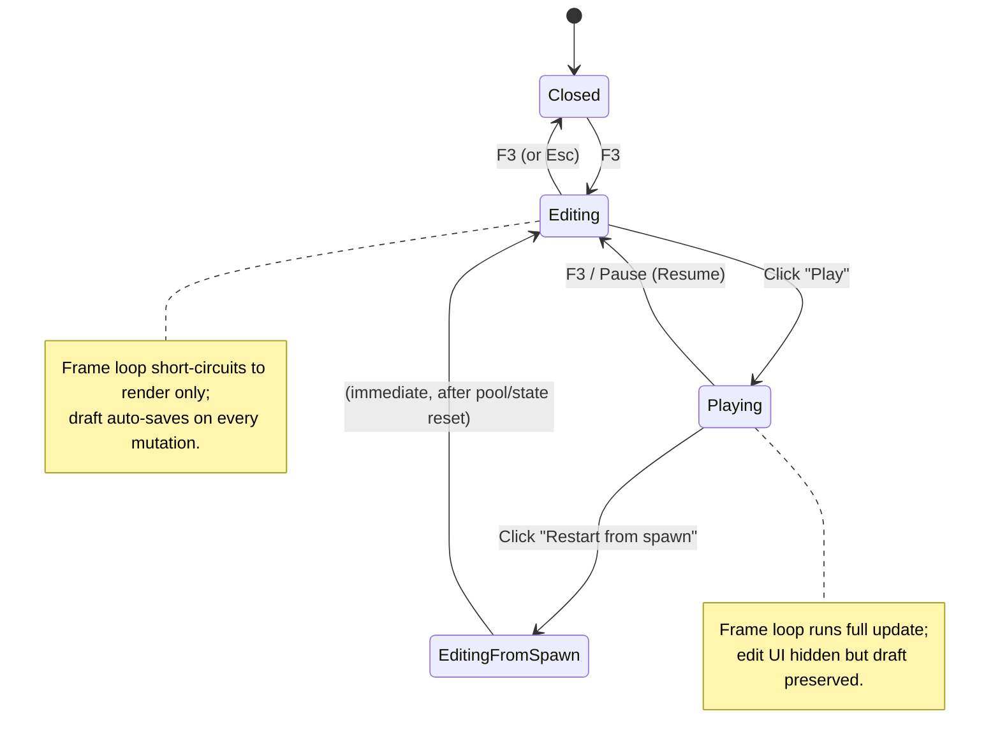
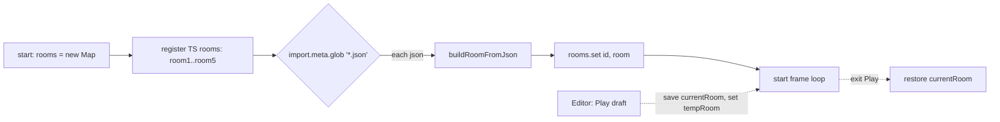

# feat: In-game level editor (ideation tool, greenfield-only)

## Summary

Реализация in-game визуального редактора в `rooms.html` как ideation-инструмента для **новых** комнат. F3 переключает edit/play mode. Drag-rect рисует стены, click-stamp размещает врагов из toolbar, properties panel правит свойства, Play запускает симуляцию прямо в том же view. Существующие 5 кампанейских комнат остаются в TS — редактор работает с JSON-файлами в `src/rooms/*.json`, экспорт через Vite dev-plugin. 8 implementation units, dependency-ordered.

---

## Problem Frame

Соло-разработчик упирается не в authoring (TS+HMR справляется — 5 комнат + 4 tutorial уже зашиплены), а в **ideation**: трудно проектировать новые комнаты слепо по координатам в коде, нельзя оценить плотность буллетов до проигрывания, микро-эксперименты ("а если поставить стенку здесь?") стоят слишком много активационной энергии. Цель плана — собрать инструмент, в котором появляется цикл "drag → play → пощупать → drag → play" в одном view, и это делается без compile-step. Existing 5 комнат специально остаются неизменными (greenfield-only MVP), чтобы исключить риски миграции / lossless preservation.

---

## Origin Document

`docs/brainstorms/level-editor-requirements.md` (2026-05-12). Все Resolve-Before-Planning вопросы резолвнуты:
- Editor framed как ideation tool, greenfield-only
- Format = runtime JSON в `src/rooms/*.json`
- pendingEnemies = discriminated union `point | randomY`
- Export = Vite dev-server plugin `POST /__editor-save`
- Sentinel / boss-rooms / tutorial-rooms — out of scope

Все 13 функциональных требований (R1–R13) + 6 acceptance examples (AE1–AE6) + 3 key flows (F1–F3) перенесены в этот план.

---

## Output Structure

План создаёт шесть новых TS-файлов в `src/rooms/` плюс Vite plugin на корне репо. Existing файлы (`rooms-game.ts`, `vite.config.ts`, `camera.ts`) модифицируются.

```
src/rooms/
  build-room-from-json.ts   ← new: JSON loader, enemy dispatcher
  room-json-types.ts         ← new: pure type definitions (RoomJson, EnemySpec, ...)
  editor.ts                  ← new: edit/play state machine, frame-loop integration
  editor-ui.ts               ← new: DOM overlay (toolbar, properties, status)
  editor-canvas.ts           ← new: mouse interaction layer (drag/click/select)
  editor-drafts.ts           ← new: localStorage persistence + conflict detection
  rooms-game.ts              ← modified: editor handle, F3 binding, frame-loop gate
  *.json                     ← (future) authored rooms exported by editor

src/lib/
  camera.ts                  ← modified: mode field, zoom, pan offsets

vite-plugin-editor.ts        ← new: dev-server endpoint for file writes
vite.config.ts               ← modified: register plugin
```

Структура отражает план scope. Per-unit `Files:` секции авторитетны для конкретных создаваемых/правленых файлов.

---

## High-Level Technical Design

*Эти sketches — directional guidance для review, не implementation specification. Имплементатор использует их как контекст, не код для воспроизведения.*

### RoomJson schema (грамматика-набросок)

```
RoomJson := {
  id: string                          // unique, matches filename stem
  width?: number = 1200
  height?: number = 800
  spawnX: number
  spawnY: number
  walls: WallSpec[]
  enemies: EnemySpec[]
  pendingEnemies?: PendingEnemySpec[]
  door?: DoorSpec | null
  backDoor?: DoorSpec | null            // optional — for bidirectional rooms (3/5 existing rooms use it)
  prevRoomId?: string | null            // matches backDoor; wired manually post-export
  initialKey?: { x: number, y: number }
  ambientBullets?: AmbientBulletField  // optional, numeric-only edit in MVP
  worldLabels?: WorldLabel[]            // optional, numeric-only edit in MVP
  nextRoomId?: string | null            // wired manually by user post-export
  message?: string
}

WallSpec := {
  x, y, w, h: number
  dashable?: boolean
  infected?: boolean
  mergeLeft?, mergeRight?, mergeTop?, mergeBottom?: boolean   // numeric-only edit
}

EnemySpec := {
  type: 'turret' | 'watcher' | 'hunter'   // Sentinel excluded
  x, y: number
  dropsKey?: boolean
  opts?: TurretOpts | HunterOpts          // Watcher has no opts
}

PendingEnemySpec := {
  type: 'turret' | 'watcher' | 'hunter'
  opts?: ...
  triggerX: number
  spawn:
    | { kind: 'point', x: number, y: number }
    | { kind: 'randomY', x: number, yRange: [number, number] }
}

DoorSpec := {
  x, y, w, h: number
  initial?: 'closed' | 'open' = 'closed'
  requiresKey?: boolean = false
  flipped?: boolean = false
}
```

Loader `buildRoomFromJson(json, id)` диспатчит на конструкторы существующих классов (`Turret`/`Watcher`/`Hunter`) и `makeDoor()` factory; возвращает runtime `Room`. Sentinel out of schema by design (boss-rooms code-only per Key Decision).

### Editor state machine



### Frame-loop gate integration

```
frame(now):
  recordFrame; perfFrameStart; dt = ...

  if menu.isOpen() OR devMenu.isOpen():        // existing
      render(); requestAnimationFrame; return

  if editor.isPaused():                          // new — Editing state
      render(); requestAnimationFrame; return

  // else: full update pass
  //   - if editor.isPlaying(), currentRoom may be a draft-built Room
  //     (saved/restored at edit→play and play→edit boundaries)
  ...
```

### JSON rooms in the room registry



Editor's "Play from draft" не использует Map — оно делает `tempRoom = buildRoomFromJson(draft)` и временно подменяет `currentRoom`. Map-registration auto-pickup-on-Export — для запуска authored room как часть кампании после Export'а (через HMR на новом файле).

---

## Requirements

Carry-forward from origin doc, grouped:

**Edit-mode UI**
- R1: F3 переключает edit/play modes — covers F1
- R2: simulation frozen в edit-mode — covers F1
- R3: 10 px grid с тогл-снапом — covers AE2
- R4: properties panel для выделенной сущности — covers AE2
- R13: middle-mouse pan + scroll zoom 0.5×–2.0× — covers F1

**Placeable entities (MVP)**
- R5: walls (drag-rect), врaги (click-stamp), spawn, door, key, pendingEnemies (point|randomY), room size (numeric-only in properties panel — drag-edge handles dropped from MVP scope) — covers AE1, AE2, AE3
- R5a: ambientBullets / worldLabels / wall flags preserved как numeric-only fields

**Live play**
- R6: Play в том же view — covers F2, AE1
- R7: Resume + Restart-from-spawn, pool clear at Resume — covers AE3

**Связь с existing**
- R8: greenfield-only, импорт existing 5 не входит в MVP
- R9: tutorial / Sentinel out of scope

**Persistence + Export**
- R10: localStorage drafts + DRAFT badge + conflict banner — covers AE4, AE5
- R11: Export через Vite plugin — covers F3, AE4
- R12: Revert — covers AE6

---

## System-Wide Impact

| Surface | Impact | Mitigation |
|---|---|---|
| `src/rooms/rooms-game.ts` (3039 LOC) | Inserts editor handle, F3 binding, frame-loop gate (3 disjunct), state-save/restore at Play boundary. ~50–80 line diff. | Изолируем максимум логики в `src/rooms/editor.ts`; rooms-game touches stay surgical (delegation, not inline implementation). |
| `vite.config.ts` | Registers `vite-plugin-editor`. Plugin only active in `serve` mode. | Plugin guarded `apply: 'serve'`; не попадает в prod build. |
| `src/lib/camera.ts` | New `mode` and `zoom` fields. Existing `updateCamera` signature unchanged (bounds arg unused remains unused). | Default `mode = 'follow'`, `zoom = 1` — existing call sites не меняются. |
| `localStorage` quota | New key `dash-proto:editor-drafts:v1`; per-room draft ~5–20 KB JSON. | Single-user solo tool; quota не должен быть проблемой даже при десятках drafts. |
| Performance | Edit-mode рендерится full pipeline + DOM overlay. В Play-from-draft бенчмарки те же что у normal play. | Edit-mode не tick'ает update — лёгкий по CPU. DOM overlay стандартный паттерн (см. dev-menu) — не влияет на 60fps. |
| Existing 5 комнат | NOT modified by editor. JSON loader path параллельный TS builder path; они coexist. | Greenfield-only scope сразу исключает регрессии. |
| Object pools | Resume clears `bullets/particles/rings/floatingTexts` via `compact*(list, () => false)` API. Lasers — exception (`lasers = []`, no pool exists in codebase). | Использовать pool-aware compaction, НЕ `list = []` для pooled lists (paid-in-iterations lesson из HANDOVER.md). |
| Production build | Editor code (handle, F3 binding, all editor modules) wrapped в `if (import.meta.env.DEV)`. Tree-shaker удаляет в `pnpm build`. | Endpoint `__editor/save` уже guard'нут `apply: 'serve'`; этот guard покрывает client side. |
| Network exposure | Vite plugin endpoint `POST /__editor/save` блокирован для non-loopback remote addresses + Origin allow-list (localhost-only) + body size cap 512KB + symlink-safe path resolve + schema validation pre-write. | См. U3 5-layer hardening. Закрывает tunnel-exposure через `allowedHosts` (ngrok / cloudflare). |

---

## Key Technical Decisions

1. **Edit-mode mutation strategy: in-place на `currentRoom` через `commitRoomMutation(kind)` helper.** Когда пользователь в edit-mode двигает стену или врагa, мы мутируем `currentRoom.walls[i]` / `currentRoom.enemies[i]` directly. Все мутации идут через единственный helper `editor.ts → commitRoomMutation(kind: 'wall' | 'size' | 'enemy' | 'door' | 'key' | 'pending')`, который ОБЯЗАТЕЛЬНО вызывает `syncRoomFx()` (rebuilds wallFx + arenaBg + gridNodes + archiveFx — НЕ только walls; размер комнаты тоже triggers это). Альтернатива — rebuild-and-snap — отвергнута: ideation требует видеть, как изменение влияет на текущее состояние врагов. Rebuild сбросил бы их state. Цена in-place: явное cache invalidation через helper + риск edge-cases (враг внутри новой стены) — митигирован через "Restart from spawn" как safe-mode escape. **Дополнительно:** при drag triggerX на pendingEnemy, helper сбрасывает `pendingEnemies[i].spawned = false`, чтобы re-positioned trigger сработал в следующий play tick. Это general pattern — любая мутация "fired-once" state требует explicit reset через helper.

2. **Editor handle создаётся в `start()` rooms-game.ts параллельно `menu` и `devMenu`.** Делит closure refs (`currentRoom`, `rooms`, `transitionToRoom`, `restartRun`, `camera`, `bullets`, `particles`, `rings`, `floatingTexts`, `lasers`). Альтернатива — модульный handle, который принимает callbacks — отвергнута: rooms-game монолитен по дизайну (3039 LOC), вкручиваться извне дороже чем делить closure scope.

3. **JSON discovery через `import.meta.glob('./*.json', { eager: true })`.** Вите статически собирает все `.json` в `src/rooms/` на билде, регистрирует в `rooms` Map. Альтернатива — runtime fetch — отвергнута: больше fragility, медленнее, и Vite HMR на JSON работает прозрачно. Новый JSON-файл (после Export) подхватывается HMR'ом в течение секунды.

4. **z-index editor = 150.** Между pause-menu (100) и dev-menu (200). Reason: dev-menu должен оставаться доступен поверх editor (для god-mode toggle в emergency-debug сценариях во время edit). Pause-menu редко нужен поверх editor.

5. **Pool clearing на Resume через `compact*(list, () => false)`, НЕ reassignment — кроме lasers.** Для `bullets / particles / rings / floatingTexts` используем pool-aware compaction: `compactBullets(bullets, () => false)` etc. — drain'ит pool правильно, возвращает Float32Array trail buffers. Это paid-in-iterations lesson из `HANDOVER.md`. **Lasers — explicit exception**: `lasers` НЕ пулятся в кодбейсе (нет `compactLasers` / `releaseLaser` / `laserPool` API), поэтому для них `lasers = []` — единственно возможный путь, и это совпадает с тем, как rooms-game.ts сам очищает lasers в `restartRun` / `transitionToRoom`. Если когда-то добавится laser pool, тогда и laser-clear перейдёт на compact API.

6. **Edit-mode camera — отдельный mode, не overload `updateCamera`.** Добавляем `camera.mode: 'follow' | 'edit'` и `camera.zoom`. В edit-mode follow logic пропускается, pan offset применяется напрямую. В render path внутри world transform добавляем `ctx.scale(zoom, zoom)`. Альтернатива — multiplex через `targetX/Y` — отвергнута: lerp 0.08 будет конфликтовать с middle-mouse drag.

7. **Render path в edit-mode = full pipeline rooms-game, заморожен на update.** Edit UI рисуется поверх через DOM, НЕ canvas-native. Reason: LESSONS.md "literally copy" lesson #1 (paid-in-iterations) — каждый раз когда мы рисовали "minimum viable" render, он не совпадал с игровым видом, и это стоило 6 итераций на boss epilogue. Полный pipeline → визуальный feedback в editor 1-в-1 совпадает с тем, как комната будет играться.

8. **Test-play использует temporary `currentRoom` replacement.** При нажатии Play в editor: сохраняем `oldCurrentRoom = currentRoom`, делаем `currentRoom = buildRoomFromJson(draft)`, спавним игрока в `draft.spawnX/Y`, очищаем projectile pools, запускаем normal frame loop. При выходе из Play: восстанавливаем `currentRoom = oldCurrentRoom`. Door в draft test-play игнорируется (просто визуальный элемент) — comm chain `nextRoomId` не активен. Это изолирует editor playtest от campaign progression.

9. **Conflict banner: compare hash JSON-файла, не mtime.** При Export сохраняем `codeHash = sha256(json)` в drafts. При reload сравниваем с current hash файла. Reason: mtime ненадёжен (touch, IDE rewrites, git checkout). Hash детерминирован. Размер JSON ≤ ~20KB, хэш быстрый.

10. **Storage key: `dash-proto:editor-drafts:v1`.** Префикс `dash-proto:` (не `dash-prototype:`) — соответствует v4/v5-era convention. Версия v1 с миграционным no-op-loader'ом с первого дня (per ARCHITECTURE.md storage rules).

11. **Тесты — manual verification scenarios.** В repo нет vitest/jest, добавление test framework — отдельный follow-up. Per-unit `Test scenarios` секции = чеклисты для manual проверки в браузере. Recommendation: добавить vitest для pure helpers (`build-room-from-json.ts`, `editor-drafts.ts`) в отдельный follow-up PR.

---

## Implementation Units

### U1. Room JSON schema and loader

**Goal:** Define JSON shape mirroring `Room` runtime type, implement `buildRoomFromJson(json, id): Room` returning fully-constructed Room instance with enemy classes and door inflated from data.

**Requirements:** R5 (entity types), R5a (pass-through fields), R8 (greenfield format), Key Decision #3 (JSON discovery), pendingEnemies discriminated union from Key Decisions of origin.

**Dependencies:** None — foundational.

**Files:**
- `src/rooms/build-room-from-json.ts` (new)
- `src/rooms/room-json-types.ts` (new — pure type definitions, no runtime)

**Approach:**
- Define `RoomJson`, `WallSpec`, `EnemySpec`, `PendingEnemySpec`, `DoorSpec`, `PendingSpawnSpec` types in `room-json-types.ts`. Mirror `src/lib/room.ts` shape with subset (no callbacks, Sentinel excluded).
- `buildRoomFromJson(json: RoomJson, id?: string): Room` does pure data → Room transform:
  - Enemy dispatcher: switch on `spec.type`, construct `new Turret(x, y, opts)` / `new Watcher(x, y)` / `new Hunter(x, y, opts)`, set `dropsKey` if specified.
  - PendingEnemies inflated: для `kind: 'point'` создаём фабрику возвращающую enemy на (x, y); для `kind: 'randomY'` создаём фабрику вычисляющую `y = lerp(yRange[0], yRange[1], Math.random())` при каждом вызове. Эта закрытая функция и есть `PendingEnemy.spawn`. Поле `spawned: false` обнуляется при каждом вызове `buildRoomFromJson`.
  - Door inflated через `makeDoor(spec.x, spec.y, spec.w, spec.h, spec.initial ?? "closed", spec.requiresKey ?? false, spec.flipped ?? false)`.
  - `width / height` default 1200 / 800. `useCamera = true` если width > 1200 OR height > 800.
- Validation: throw on missing required fields (`spawnX`, `spawnY`, `id`), unknown enemy type, invalid pendingEnemy kind, negative dimensions.

**Technical design:** see grammar sketch in High-Level Technical Design. Plain TS types mirroring runtime shape; the loader is a pure transform.

**Patterns to follow:**
- `src/rooms/room1.ts`..`room5.ts` — TS builder pattern that returns `Room`. JSON loader's output должен быть structurally identical к выходу этих builders.
- `src/lib/door.ts:22-32` `makeDoor()` factory — use directly.
- `src/lib/enemies/{turret,watcher,hunter}.ts` constructor signatures — see Repo research findings table.

**Test scenarios:**
- Happy path: minimal valid JSON `{ id, spawnX, spawnY, walls: [], enemies: [] }` → `Room` с пустыми коллекциями.
- Walls: spec с `dashable: true` / `infected: true` → preserved on runtime Wall.
- Enemies: spec с `type: 'turret', opts: { startsAggressive: true }` → `Turret` instance с правильным awarenessState.
- pendingEnemies `kind: 'point'`: spawn возвращает enemy в фиксированной (x, y) — `Covers AE3`.
- pendingEnemies `kind: 'randomY'`: spawn возвращает enemy с x = spec.x, y между yRange[0] и yRange[1] (вызвать 10 раз, проверить распределение) — `Covers AE3`.
- Door requiresKey: spec `{ requiresKey: true }` → `Room.door.requiresKey === true`.
- initialKey: spec `{ x: 100, y: 200 }` → `Room.initialKey === { x: 100, y: 200 }`.
- AmbientBullets passthrough: spec присутствует → preserved 1-в-1 на Room.
- Error paths: missing `spawnX` → throws с message naming the field; unknown enemy type `'sentinel'` → throws.
- Edge: empty `walls: []` + `enemies: []` — valid, builds empty Room.

**Verification:** `buildRoomFromJson` со sample JSON выдаёт Room, который проходит через `rooms-game.ts` render и play (можно временно зарегистрировать в `rooms` Map и dev-menu teleport'ом проверить).

---

### U2. Register JSON rooms in the rooms Map

**Goal:** Discover все `src/rooms/*.json` файлы на билде через Vite `import.meta.glob`, регистрировать в `rooms` Map alongside TS-built rooms. Гарантировать корректную работу `restartRun` (rebuildAllRooms) и `transitionToRoom` для JSON-комнат.

**Requirements:** R8 (greenfield → JSON rooms loadable for campaign integration), Key Decision #3.

**Dependencies:** U1.

**Files:**
- `src/rooms/rooms-game.ts` (modified — `start()` ~line 567 area, `rebuildAllRooms()` ~line 786)

**Approach:**
- In `start()` after the 5 `rooms.set("roomN", buildRoomN())` calls:
  ```
  const jsonModules = import.meta.glob('./*.json', { eager: true });
  for each module:
    const json = module.default as RoomJson;
    rooms.set(json.id, buildRoomFromJson(json));
  ```
  Note: `import.meta.glob` пути relative к `rooms-game.ts` (на котором стоит `src/rooms/`).
- В `rebuildAllRooms()` — повторить ту же логику. JSON entries не кешируются между restarts; pendingEnemies.spawned обнуляется каждый раз (т.к. `buildRoomFromJson` создаёт свежие closure объекты).
- Validation на старте: если JSON.id уже есть в Map (collision с TS room) → console.error и skip с warning toast.

**Patterns to follow:**
- Existing room registration block в `src/rooms/rooms-game.ts:567-572`.
- `rebuildAllRooms()` в `:786-792`.

**Test scenarios:**
- Создать `src/rooms/test-room.json` с минимальным валидным контентом → запустить `pnpm dev` → dev-menu teleport должен показать "test-room" в списке → телепорт работает.
- Verify rebuildAllRooms: убить врагов в JSON-комнате, рестартануть run → enemies на месте, pendingEnemies.spawned = false.
- ID collision: создать `src/rooms/room1.json` с `id: "room1"` → console.error, skip, TS room1 wins.
- Empty case: no `*.json` files → import.meta.glob возвращает `{}` → no-op, всё работает как раньше.
- HMR: модифицировать `test-room.json` на лету → Vite HMR подхватывает → следующий restart использует новый JSON.

**Verification:** dev-menu Teleport показывает JSON rooms; телепорт работает; restart rebuilds корректно.

---

### U3. Vite dev-server plugin for editor export

**Goal:** Create Vite plugin exposing `POST /__editor/save` endpoint that accepts `{ id, json }` and writes to `src/rooms/<id>.json`. Dev-mode only (`apply: 'serve'`); guards path containment.

**Requirements:** R11 (Export), F3 (save changes back to code), Key Decision from origin (Vite plugin export mechanism).

**Dependencies:** None.

**Files:**
- `vite-plugin-editor.ts` (new — repo root)
- `vite.config.ts` (modified — register plugin)

**Approach:**
- Plugin exports default function `editorPlugin(): Plugin`:
  - `name: 'dash-editor'`
  - `apply: 'serve'` — disables в `vite build`
  - `configureServer(server)` adds middleware с **5-layer hardening**:
    - Path: `POST /__editor/save`
    - **Network gate (P1 — addresses tunnel exposure):** reject если `req.socket.remoteAddress` не loopback (`127.0.0.1`, `::1`, `::ffff:127.0.0.1`) — возвращает 403. Vite `allowedHosts` already permits ngrok / cloudflare tunnels; без этого gate POST /__editor/save интернет-доступен через активный туннель. Optional defense-in-depth: require header `X-Editor-Token: <random per-init token>` — token генерируется в `configureServer` и пишется в gitignored `.editor-token` файл, editor UI читает через separate dev-only fetch.
    - **Origin allow-list (P2 — CSRF):** проверить `req.headers.origin` — accept только `null` (curl/direct), `http://localhost:*`, `http://127.0.0.1:*`. Reject остальные с 403.
    - **Body size cap (P2):** reject если `Content-Length > 524288` (512 KB ≈ 25× expected max room JSON) — возвращает 413.
    - Body: JSON `{ id: string, json: object }`
    - Validation: `id` regex `^[a-z0-9-]+$` (no path traversal, no `..`, no `/`)
    - Resolve target path: `path.resolve(projectRoot, 'src/rooms', `${id}.json`)`
    - **Symlink-safe containment (P2):** `fs.realpathSync(path.dirname(targetPath))` (родительская папка обязана существовать) + `startsWith(fs.realpathSync(path.resolve(projectRoot, 'src/rooms')) + path.sep)`. На macOS `path.resolve` НЕ резолвит symlinks — без realpath можно перезаписать произвольный target через подсунутый symlink в `src/rooms/`.
    - **Schema validation pre-write (P2):** запустить `buildRoomFromJson(payload.json, payload.id)` (из U1) и если он бросает — return 400 с error message. Иначе corrupt JSON ложится на disk и крашит loader при следующем HMR pickup.
    - Write `fs.writeFileSync(targetPath, JSON.stringify(json, null, 2), 'utf8')`
    - Response: 200 `{ ok: true, path: 'src/rooms/<id>.json' }` on success; 400 on malformed body / schema fail; 403 on path escape / non-loopback / bad origin; 413 on oversize body; 500 on fs error.
- `vite.config.ts` adds `plugins: [editorPlugin()]` after `base`.

**Patterns to follow:**
- `vite.config.ts` структура — currently no `plugins` field, add it.
- Vite plugin docs (already known): `configureServer` middleware pattern.

**Test scenarios:**
- Happy path: `curl -X POST http://localhost:5173/__editor/save -d '{"id":"test-room","json":{"id":"test-room","spawnX":600,"spawnY":400,"walls":[],"enemies":[]}}'` → returns 200, file created at `src/rooms/test-room.json` — `Covers AE4`.
- Path traversal attempt: `{"id":"../etc/passwd"}` → 403, no file written.
- Path traversal with absolute: `{"id":"/etc/passwd"}` → 403 (regex rejects `/`).
- Malformed body: missing `id` or `json` → 400.
- Production build: `pnpm build` succeeds; built bundle does not contain plugin code or endpoint.
- HMR after write: `curl ...save` → файл записан → Vite HMR подхватывает new room (см. U2 test) → game loop picks up.

**Verification:** Curl POST writes файл; path traversal blocked; production build не содержит endpoint; HMR обновляет JSON-комнаты live.

---

### U4. Editor state machine and frame-loop integration

**Goal:** Создать `Editor` handle с state machine (closed/editing/playing), F3 keydown binding, frame-loop pause gate. Реализовать pool-aware Resume и Restart-from-spawn. Сохранять / восстанавливать `currentRoom` при edit↔play boundary.

**Requirements:** R1 (F3 hotkey), R2 (freeze), R6 (live play in same view), R7 (Resume + Restart-from-spawn + pool clear), Key Decisions #1, #2, #5, #8.

**Dependencies:** U1 (для test-play building tempRoom from draft), U2 (Map registration if user wants new room to appear in chain).

**Files:**
- `src/rooms/editor.ts` (new — main editor handle)
- `src/rooms/rooms-game.ts` (modified — start() handle creation, keydown F3 binding ~line 990, frame-loop gate ~line 1394)

**Approach:**
- **Prod-build guard.** Editor handle creation, F3 binding, и весь `editor.ts`/`editor-ui.ts`/`editor-canvas.ts`/`editor-drafts.ts` модули wrapped в `if (import.meta.env.DEV)`. В prod build (`pnpm build`) tree-shaker удаляет весь editor код — deployed `rooms.html` не имеет F3 toggle и не показывает broken Save endpoint.
  ```
  let editor: EditorHandle | null = null;
  if (import.meta.env.DEV) {
      editor = createEditor({ ... });
  }
  ```
- `Editor` factory `createEditor(config: EditorConfig): EditorHandle`:
  - `EditorConfig` принимает callbacks/refs: `getCurrentRoom`, `setCurrentRoom`, `getDraft`, `setDraft`, pool getter, `triggerSyncRoomFx`, `triggerSnapCamera`, `getCamera`, и т.д.
  - Internal state: `mode: 'closed' | 'editing' | 'playing'`, `savedRoomBeforePlay: Room | null`.
  - `EditorHandle = { isOpen, isPaused, isPlaying, toggle, openEditing, exitToEditing, startPlay, resume, restartFromSpawn, commitRoomMutation, destroy }`.
  - `isPaused()` returns `mode === 'editing'` — это и есть условие для frame-loop short-circuit.
  - `isPlaying()` returns `mode === 'playing'` — используется внешним кодом для решений ("don't credit best score").
  - **`commitRoomMutation(kind)`** — единственный mutation entry point. Канвас layer (U6) и properties panel (U5) не трогают `currentRoom` напрямую; они проходят через этот helper, который вызывает `syncRoomFx()` (rebuilds wallFx/arenaBg/gridNodes/archiveFx), при необходимости сбрасывает `pendingEnemies[i].spawned = false`, и помечает draft dirty.
- **F3 binding в rooms-game.ts:** в keydown handler сразу после `if (devMenu.isOpen()) return;` (~line 980), вставить:
  ```
  if (editor && code === "F3") {
      editor.toggle();
      preventDefault;
      return;
  }
  ```
  Проверка `editor &&` нужна для prod-build guard (в production `editor === null`).
- **Frame-loop gate** (~line 1394): расширить existing `if (menu.isOpen() || devMenu.isOpen())` до `if (menu.isOpen() || devMenu.isOpen() || (editor?.isPaused() ?? false))`. Optional chain преобразует `null` в `false` корректно.
- **Edit→Play transition (startPlay):**
  1. `savedRoomBeforePlay = currentRoom`
  2. `tempRoom = buildRoomFromJson(getDraft())`
  3. `setCurrentRoom(tempRoom)`
  4. Reset projectile pools: `compactBullets(bullets, () => false)`, `compactParticles(particles, () => false)`, `compactRings(rings, () => false)`, `compactFloatingTexts(floatingTexts, () => false)`. **Lasers — exception:** `lasers = []` (no pool, see Key Decision #5).
  5. Respawn player at `tempRoom.spawnX/Y` (use existing `spawnPlayerInCurrentRoom()`)
  6. `triggerSyncRoomFx()` (recompute wallFx etc.)
  7. `triggerSnapCamera()`
  8. `mode = 'playing'`
  9. `lastTime = performance.now()` (избежать dt-jump)
- **Play→Edit transition (resume back to editing):**
  1. `setCurrentRoom(savedRoomBeforePlay)`
  2. `savedRoomBeforePlay = null`
  3. Pool clear via `compact*()` per R7 (lasers `= []` exception).
  4. `triggerSyncRoomFx()`
  5. `mode = 'editing'`
  6. `lastTime = performance.now()` on resume from pause
- **Restart-from-spawn:** rebuild tempRoom fresh from draft + respawn player. Effectively `startPlay()` cycle without the save (already in playing mode).
- **Player death during test-play:** death animation runs normally (existing `failRun` logic NOT triggered because we gate `runState = "failed"` flow on `!editor?.isPlaying()`). После death animation completes, editor shows "Test play ended — F3 to edit / R to restart" overlay; user pressing F3 returns to edit-mode, R triggers `restartFromSpawn()`.

**Execution note:** Pool clearing — **MUST use `compact*(list, () => false)` API, never `list = []`**. Это paid-in-iterations lesson (HANDOVER.md). Reassignment leaks Float32Array trail buffers и breaks pool stability.

**Technical design:** see state machine diagram in High-Level Technical Design.

**Patterns to follow:**
- `src/lib/dev-menu.ts:160-165` — handle shape (`isOpen`, `toggle`, `destroy`) и config-via-callbacks pattern.
- `src/rooms/rooms-game.ts:1387-1398` — frame loop gate.
- `src/rooms/rooms-game.ts:842-852` — list-reset pattern at room transition (mirror, but use pool API).
- `src/rooms/rooms-game.ts:1910-1917` — pendingEnemies tick (gets fresh tempRoom).

**Test scenarios:**
- F3 в normal play → editor opens (mode=editing), update pass skipped, render still runs (game frozen visually) — `Covers AE1, AE2`.
- F3 again → editor closes (mode=closed), game resumes без dt-jump.
- Esc в editing → editor closes (через Esc capture-phase handler в U5).
- Click Play в editor → mode=playing, currentRoom = tempRoom from draft, player respawned, pools cleared, simulation runs — `Covers AE1, F2`.
- Pause-toggle in playing (F3 again) → mode=editing, currentRoom restored to savedRoomBeforePlay, pools cleared (per R7) — `Covers AE3`.
- Click "Restart from spawn" in editing → tempRoom rebuilt from draft fresh, player at spawn, pools cleared, mode=playing — `Covers AE3`.
- Player dies during test-play → run-fail overlay NOT shown (gated on editor.isPlaying), but death animation plays. Press F3 to exit. (Optional: show "Test play ended" inline.)
- Edge: mutate draft в editing, click Play → tempRoom reflects новейшие правки.
- Edge: F2 perf overlay вкл во время editing → frame-loop continues to render path which still respects perfBegin/perfEnd; не ломается.
- Edge: dev-menu открыть поверх editing → `if (devMenu.isOpen())` returns first, editor stays editing, F3 ignored until dev-menu closed.

**Verification:** F3 toggles edit/play; pool memory не растёт между cycles (DevTools heap snapshot); state.runState не флипается в "failed" во время test-play; transitions не оставляют projectiles в air.

---

### U5. Editor DOM overlay UI

**Goal:** DOM overlay поверх canvas с тулбаром (entity types), properties panel (выделенная сущность), header (DRAFT badge, Save/Revert/Play buttons), status bar (mouse coords, snap toggle). Эстетика — как dev-menu / settings-menu / pause-menu (стандарт проекта).

**Requirements:** R4 (properties panel), R10 (DRAFT badge), R11 (Save button), R12 (Revert button), R3 (snap toggle button), Key Decisions #4 (z-index 150), #7 (DOM, not canvas-native).

**Dependencies:** U4 (editor handle provides state and commands).

**Files:**
- `src/rooms/editor-ui.ts` (new)

**Approach:**
- Factory `createEditorUI(config: EditorUIConfig): EditorUIHandle`. Returns `{ root, isOpen, open, close, setSelection, setDraftMarker, setMode, destroy }`.
- DOM structure (built imperatively via `createElement`):
  ```
  div.editor-overlay.open
    div.editor-header
      span.draft-badge "DRAFT" (visible only if draft has unsaved changes since last Export)
      span.room-id "<id>"
      div.editor-actions
        button "Play" / "Pause"
        button "Restart from spawn"
        button "Save (Export)"
        button "Revert"
        button "Close" (F3)
    div.editor-toolbar (vertical, left side)
      tool-button "Select" (default)
      tool-button "Wall"
      tool-button "Turret"
      tool-button "Watcher"
      tool-button "Hunter"
      tool-button "Spawn"
      tool-button "Door"
      tool-button "Key"
      tool-button "Lazy spawn"
      separator
      toggle "Snap (10px)"
    div.editor-properties (right side)
      h3 "Properties"
      <dynamic content based on selection>
    div.editor-status (bottom)
      span "x: 0, y: 0"  (mouse world coords)
      span "Zoom: 100%"
      span "Selected: <type>" (or "—")
      span "Drafts: <date>" (last auto-save timestamp)
    div.conflict-banner.hidden (shown when draft conflicts with code)
      span "Draft from <date>, code is newer"
      button "Keep draft"
      button "Revert to code"
  ```
- Style injection (`STYLE_ID = "dp-editor-style"`). z-index 150.
- Esc handler **capture phase** (per ARCHITECTURE.md keybinds lesson): close editor on Esc, `stopPropagation` to prevent pause-menu fire underneath. Pattern из dev-menu.
- Toolbar tool selection → fires `config.onSelectTool(toolName)` (canvas layer reads).
- Properties panel — switch on selection type, render appropriate fields:
  - **Room (pseudo-entity, selected when nothing else is selected via toolbar "Room" toggle):** width, height (numeric inputs only, 10px snap-aware). NO drag-edge handles in MVP — properties-panel-only edit per Key Decision.
  - Wall: x, y, w, h (number inputs), dashable / infected / merge* checkboxes
  - Turret: x, y, startsAggressive (checkbox), fireIntervalSec / bulletSpeed / spawnInvulnerableSec (optional numeric), dropsKey
  - Watcher: x, y, dropsKey
  - Hunter: x, y, startsAggressive, ignoresWalls, dropsKey
  - Spawn: x, y
  - Door: x, y, w, h, initial, requiresKey, flipped, nextRoomId (text input)
  - Key: x, y
  - PendingSpawn: type select (turret/watcher/hunter), triggerX, opts, spawn kind select (point/randomY), x, y (point) или x, yRange (randomY)
  - AmbientBullets (если уже есть в Room): spawnArea, maxBullets, spawnIntervalMs, speed
  - WorldLabel (если уже есть): x, y, text, size, color, scramble
- Field changes → `config.onPropertyChange(entityRef, field, newValue)` (callback into editor.ts which calls `commitRoomMutation(kind)` per Key Decision #1).
- **Revert confirmation modal.** "Revert" клик НЕ открывает `window.confirm()` (нарушает no-DOM-for-game-UI rule). Editor рисует свой modal `.editor-confirm-modal` поверх editor overlay (z-index 175): backdrop dim + box "Discard <N> changes from <date>?" + Cancel/Revert кнопки. Same DOM-overlay pattern (single style injection, build on demand). Esc внутри modal закрывает modal без revert.

**UI State Coverage (interaction-state spec):**

Closes design-lens coverage gaps. Each rule is implementation-grade decision; имплементатор не угадывает.

- **Select tool empty-canvas click** → clear current selection silently. NO rubber-band (multi-select deferred). NO visual feedback (uncluttered editing). 4px drag threshold applies only when клик start попал на entity.
- **Play button disabled-state** → Play button is `disabled` (greyed + cursor-not-allowed + tooltip "Place a spawn point first" / "Draft has no enemies — add at least one before testing") when `buildRoomFromJson(draft)` would throw (missing spawnX/Y, etc.). State recomputed на каждой mutation. Otherwise enabled (active editor state, can play with anything ≥ minimal).
- **DRAFT badge condition** — badge **tracks dirty-vs-Export, NOT dirty-vs-localStorage**. Badge invisible immediately after `markExported()` succeeded (даже если draft в localStorage существует, его hash matches code). Badge visible whenever last-Exported hash differs from current draft state. New draft never Exported = badge visible from first mutation forward. Empty draft = badge hidden.
- **Player death during test-play** → death animation plays normally; failed-run overlay suppressed (gated on `!editor?.isPlaying()`). После death animation: editor renders inline prompt "Test play ended — F3 to edit / R to restart from spawn" поверх frozen frame. F3 returns to editing mode. R triggers `restartFromSpawn()`. No auto-respawn.
- **Snap toggle authoritative location: toolbar.** Single control (clickable button with `[Snap 10px]` label, highlighted when on). Status bar shows current state read-only ("Snap: ON 10px" / "Snap: OFF"). Both elements wired to same boolean — toolbar is the control, status bar is the indicator.
- **Conflict banner during Playing state** → detection runs only when transitioning to editing mode (editor open OR Play → Edit). Если detected mid-play, banner deferred until next editing-mode entry. Не показывается поверх game canvas.
- **Resume vs Restart-from-spawn UI** — оба видны в editor header одновременно когда в editing mode после Play. "Resume" button (returns to playing state without state reset, equivalent to F3 toggle) и "Restart from spawn" button (rebuilds tempRoom + respawns player). F3 hotkey всегда выполняет "Resume" если был play, иначе toggles edit-mode. "Pause" label на Play button показывается ТОЛЬКО когда в playing state (click → returns to editing).
- **Focus management.** Editor opens → focus moves to canvas (not properties inputs, чтобы typing keys не уходило в properties). Tab из properties input cycles внутри properties panel (focus trap). Esc внутри properties input снимает focus с input в canvas, не закрывает editor.

**Patterns to follow:**
- `src/lib/dev-menu.ts:6-145` — STYLE injection + DOM building + handle pattern.
- `src/lib/settings-menu.ts` — form-field pattern with `createElement` + label/input pairs.
- `src/rooms/pause-menu.ts` — button click-handler pattern.

**Test scenarios:**
- Open editor → toolbar visible on left, properties panel right (empty), status bar at bottom, DRAFT badge initially hidden (fresh draft, nothing changed yet) — `Covers AE1`.
- Click toolbar "Wall" → mode change reflected (tool button highlighted, cursor changes via CSS class) — `Covers AE1`.
- Make any mutation → DRAFT badge appears, status bar timestamp updates — `Covers AE4`.
- Select wall on canvas (U6) → properties panel renders width/height/dashable inputs → change width 30→60 → wall changes immediately (via onPropertyChange callback) — `Covers AE2`.
- Snap toggle → tool-state changes; canvas reflects (U6).
- Click "Save (Export)" → POST to Vite plugin (U3) → on success, DRAFT badge disappears, status toast "Saved to src/rooms/<id>.json" — `Covers AE4`.
- Click "Revert" → confirmation prompt → all changes reverted to last-exported state, DRAFT badge clears — `Covers AE6`.
- Esc inside editor → editor closes, pause-menu does NOT also open (capture-phase + stopPropagation).
- Click Play → button changes to "Pause"; toolbar/properties hidden (or dimmed); status bar shows "PLAYING".
- Resize browser → overlay reflows (CSS-driven, not pixel-pinned).
- Conflict banner: simulate code-newer scenario (см. U8) → banner visible, two buttons functional — `Covers AE5`.

**Verification:** Visual inspection всех UI states; Esc не открывает pause-menu; mutations через properties panel немедленно отражаются на canvas.

---

### U6. Canvas interaction layer

**Goal:** Mouse-driven interactions inside the world canvas during edit-mode: drag-rect для стен, click-stamp для врагов, drag-to-move для existing сущностей, selection с visual ring, hover preview, grid overlay, pendingEnemies visualization. Delete/Backspace на selected.

**Requirements:** R3 (snap grid), R5 (entity placement gestures), R5a (no visual drag for ambient/labels), AE1, AE2, AE3.

**Dependencies:** U4 (editor state), U5 (UI tool selection, properties panel sync), U7 (camera pan/zoom math for screen→world transform).

**Files:**
- `src/rooms/editor-canvas.ts` (new)
- `src/rooms/rooms-game.ts` (modified — call editor's draw hook in render path после walls/enemies, ~line 2615 area)

**Approach:**
- Factory `createEditorCanvas(config): EditorCanvasHandle`. Returns `{ attachListeners, detachListeners, draw, setTool, setSnap, getSelection, destroy }`.
- Mouse event handlers attached to canvas (only when editor open and in editing mode):
  - `mousedown`: depending on `activeTool`:
    - Select: start drag-or-click discrimination (4px threshold). If on existing entity, prepare drag; else, clear selection (silently, no visual feedback — multi-select deferred, so empty-canvas click has no rubber-band semantics).
    - Wall: start drag-rect from snapped origin.
    - Turret/Watcher/Hunter/Spawn/Door/Key: click-stamp at snapped position (mutates currentRoom via `commitRoomMutation`).
    - LazySpawn: **single-click placement**. Click at (sx, sy) → pendingSpawn создаётся с `spawn: { kind: 'point', x: sx, y: sy }`, `triggerX = sx` (default). Vertical dashed line renders at triggerX. Subsequent edit — `drag-on-vertical-line` меняет `triggerX`; `drag-on-spawn-marker` меняет spawn point. Двух кликов на одно действие нет.
  - `mousemove`:
    - Drag-rect ghost preview (Wall tool).
    - Hover indicator over existing entities (cursor: 'pointer' / draw highlight ring).
    - Pan offset update if middle-mouse drag active (delegates to U7 camera).
    - Update status bar with world coords.
  - `mouseup`:
    - Commit drag-rect → `commitRoomMutation('wall')` (helper adds to currentRoom.walls + sync).
    - Commit drag-move on entity → `commitRoomMutation('enemy' | 'door' | 'key' | 'pending')` (помимо move, для pendingEnemies triggerX drag — helper также сбрасывает `spawned = false`).
  - `wheel`: zoom (delegates to U7).
  - `contextmenu` (right-click): context menu on entity:
    - For LazySpawn: "Convert to random-Y range" / "Convert to point".
    - Default: "Delete" option.
- Keyboard: Delete / Backspace on selected entity → `commitRoomMutation` removes from currentRoom collection.
- Spawn-point is undeletable (toast "spawn cannot be deleted").
- **Hit-test priority on overlapping entities:** enemies > door > key > pendingEnemy markers > walls > spawn. Внутри tier — smallest hitbox area wins. Это deterministic — implementer не делает arbitrary choice.
- Screen → world transform: `worldX = (screenX - letterboxOffset.x) / (scale * camera.zoom) + camera.x`, `worldY = аналогично`. `letterboxOffset` приходит из `EditorCanvasConfig.getLetterboxOffset(): { x, y }` callback (значения `offsetX`/`offsetY` — closure-local в rooms-game.ts, не часть Camera type). Inverse: `screenX = letterboxOffset.x + scale * camera.zoom * (worldX - camera.x)`.
- Snap: `snap(coord) = Math.round(coord / 10) * 10` when snap on; identity when off.
- **NO room-edge drag handles** — room-size edit goes through properties panel "Room" pseudo-entity in U5 (width/height numeric inputs). Per Key Decision: drag-edge dropped from MVP scope.
- Draw layer (`draw(ctx)` called from rooms-game render path after walls/enemies inside world transform):
  - Grid: 10px lines, alpha 0.06, only when zoomed in enough to be readable (skip at zoom < 0.5).
  - **Selection ring** on selected entity: **white 2px solid + outer yellow halo 4px dashed**. White + yellow контрастирует с любым архетипом, включая cyan Turret/Watcher и orange Hunter. (Раньше план говорил cyan — но это invisible на cyan-окрашенных enemies.)
  - **Hover highlight** on entity under cursor: cyan 1px solid alpha 0.4 (остаётся cyan — transient, и контраст не критичен).
  - Drag-rect ghost (white, 1px dashed).
  - PendingEnemies: vertical dashed line at `triggerX` (full room height, white alpha 0.3); spawn marker (enemy silhouette + cyan circle, alpha 0.6); если `kind === 'randomY'`, две короткие horizontal-handles at y1, y2.
  - Spawn point: green diamond + label "SPAWN".
  - InitialKey if absent in mode but expected: dim placeholder.

**Patterns to follow:**
- Canvas event handling — никаких прямых примеров в repo, но pattern стандартный для DOM mouse events. Cleanup в destroy(): `removeEventListener`.
- Drawing patterns — see `src/rooms/rooms-game.ts:2325-2616` render path для inspiration on perfBegin/End wrapping.
- Hit testing — простой AABB для walls/door, distance-based для enemies (their `hitboxRadius`).

**Test scenarios:**
- Drag-rect creates wall: mousedown at (100,100) → drag to (200,150) → release → wall `{ x:100, y:100, w:100, h:50 }` added — `Covers AE1`.
- Snap on: drag (103, 107) → (197, 153) → snapped to (100, 100) → (200, 150) → wall `{ x:100, y:100, w:100, h:50 }`.
- Snap off (toggle): same drag → wall `{ x:103, y:107, w:94, h:46 }` (subpixel-precise) — `Covers AE2`.
- Click-stamp turret: tool "Turret" + click at (300, 400) → turret added at (300, 400) — `Covers AE1`.
- Drag existing entity: select turret → drag → entity x/y updated, properties panel reflects new coords.
- Select-on-click: tool "Select" + click on existing wall → properties panel populates with wall fields — `Covers AE2`.
- Delete: select wall + press Delete → wall removed, properties panel clears — `Covers AE1` (cleanup edge).
- Spawn protection: tool "Select" + click spawn diamond + Delete → toast "spawn cannot be deleted"; spawn stays.
- LazySpawn placement: tool "Lazy spawn" + click at (1500, 350) → pendingSpawn added with point spawn `{ x:1500, y:350 }`, triggerX=1500 (default = spawn x); vertical dashed line drawn at x=1500 — `Covers AE3`.
- LazySpawn convert: right-click pendingSpawn marker → "Convert to random-Y range" → y-range handles appear; drag handles → yRange updates.
- LazySpawn drag triggerX: drag the vertical dashed line → triggerX updates.
- pendingEnemy x-drag: drag marker → spawn.x updates (in randomY mode, x stays sole degree of freedom).
- Hit testing precision: cursor on wall edge → hover ring on wall, not adjacent wall.
- Coord display: status bar shows live world coords как mouse moves.

**Verification:** Все 8 tool modes работают; visual feedback (ghost, selection, hover, grid) рендерится корректно; sync-on-mutation вызывает syncRoomFx (стены) и обновляет HUD через editor-ui.

---

### U7. Edit-mode camera (pan + zoom)

**Goal:** Add edit-mode camera mode supporting middle-mouse drag pan + scroll-wheel zoom 0.5×–2.0×. Apply zoom in render path inside world transform. Preserve zoom across resize. Provide "Center on spawn" command.

**Requirements:** R13 (camera pan/zoom), Key Decision #6 (отдельный mode, not overload).

**Dependencies:** U4 (editor state to know when to apply edit-mode camera vs follow).

**Files:**
- `src/lib/camera.ts` (modified — add `mode` and `zoom` fields)
- `src/rooms/rooms-game.ts` (modified — render path applies zoom; recomputeLayout preserves zoom; mousemiddle / wheel handlers when editor open)

**Approach:**
- Extend `Camera` type to `{ x, y, targetX, targetY, mode: 'follow' | 'edit', zoom: number }`. Default mode `'follow'`, zoom `1`. Existing call sites (which don't touch these new fields) continue работать без изменений.
- New helpers in `camera.ts`:
  - `setCameraMode(camera, mode)` — switches mode; entering edit captures current position so player follow doesn't fight on re-enter.
  - `panCamera(camera, dx, dy)` — updates `x, y` directly (edit mode only).
  - `setCameraZoom(camera, zoom)` — clamps to `[0.5, 2.0]`, updates.
  - `centerCameraOn(camera, x, y, viewportW, viewportH)` — used by "Center on spawn".
- In `updateCamera` (existing): if `mode === 'edit'`, skip the follow logic (no targetX/Y lerp). The frame still calls `updateCamera` from rooms-game but it becomes effectively no-op в edit mode.
- Render path в rooms-game (~line 2368 area, `ctx.save() → translate`):
  ```
  ctx.save();
  ctx.translate(-camera.x, -camera.y);
  if (camera.zoom !== 1) ctx.scale(camera.zoom, camera.zoom);
  ... draw world ...
  ctx.restore();
  ```
- Middle-mouse pan handlers (installed когда editor opens, removed on close):
  - `mousedown` with `button === 1` → pan-start; capture starting screen coords.
  - `mousemove` while panning → `panCamera(camera, dx * (1/scale/zoom), dy * (1/scale/zoom))`.
  - `mouseup` button 1 → pan-end.
- Wheel handler:
  - `wheel` deltaY > 0 (scroll down) → `newZoom = clamp(zoom * 0.9, 0.5, 2.0)`.
  - deltaY < 0 → `newZoom = clamp(zoom * 1.1, 0.5, 2.0)`.
  - **Pivot zoom anchored on cursor world position.** Before changing zoom, compute `cursorWorld = screenToWorld(mouseX, mouseY)` using current zoom. After updating zoom, adjust `camera.x` и `camera.y` так чтобы тот же cursorWorld point остался под cursor:
    ```
    cursorWorldX = (mouseX - letterboxOffset.x) / (scale * zoom) + camera.x
    // ... update zoom ...
    camera.x = cursorWorldX - (mouseX - letterboxOffset.x) / (scale * newZoom)
    // analogous for y
    zoom = newZoom
    ```
    Без этого adjustment-а зум "уезжает" из-под cursor'a — самое раздражающее ощущение в редакторе.
- `recomputeLayout` (resize event handler): preserve `camera.zoom`; don't reset.
- "Center on spawn" button in editor-ui → calls `centerCameraOn(spawn.x, spawn.y)`.
- On exit edit mode: `setCameraMode('follow')` + `snapCamera`.

**Patterns to follow:**
- `src/lib/camera.ts` existing structure (very lean — easy to extend).
- `src/rooms/rooms-game.ts:533-541` recomputeLayout pattern.
- `src/rooms/rooms-game.ts:2353-2360` letterbox transform.

**Test scenarios:**
- Open editor in Room 4 (8000px corridor) → can pan middle-mouse to far right end, see entities at x=7000.
- Wheel zoom in (zoom=2.0) → entities visually 2× larger, sprites still readable.
- Wheel zoom out (zoom=0.5) → entire Room 4 visible at once (3600/0.5=8000px maps to 4000-screen, fits with letterbox).
- Pivot zoom: move cursor to specific entity → wheel zoom → entity stays under cursor.
- Resize window while panned and zoomed → layout reflows, zoom and pan preserved.
- "Center on spawn" button → camera snaps to (spawnX - viewW/2, spawnY - viewH/2) (or appropriate centering math).
- Exit editor → camera mode = follow → next frame, follow lerps to player (no jump).
- Render path: zoom=2 in edit-mode → grid overlay still readable (per snap-grid behaviour in U6).

**Verification:** Pan/zoom feel natural; zoom-pivot стабильна; resize не сбрасывает state; transition в follow mode плавный.

---

### U8. localStorage drafts and conflict detection

**Goal:** Persist editor drafts per-room to `localStorage` under key `dash-proto:editor-drafts:v1`. Auto-save on every mutation, debounced. Compare against committed JSON's hash to detect external code update; show conflict banner.

**Requirements:** R10 (autosave drafts + DRAFT badge + conflict banner), R12 (Revert to code), Key Decisions #9 (hash, not mtime), #10 (versioned storage key).

**Dependencies:** U4 (editor handle calls into drafts on mutations + on open), U5 (UI renders banner + DRAFT badge).

**Files:**
- `src/rooms/editor-drafts.ts` (new)

**Approach:**
- Storage key: `DRAFTS_STORAGE_KEY = "dash-proto:editor-drafts:v1"`.
- Stored shape:
  ```
  {
    version: 1,
    drafts: {
      [roomId: string]: {
        json: RoomJson,
        savedAt: number,           // ms timestamp
        exportedHash: string | null  // sha256 of last-exported JSON; null if never exported
      }
    }
  }
  ```
- API (async где требуется hash):
  - `loadDraft(roomId): DraftEntry | null` — sync.
  - `saveDraft(roomId, json): void` — updates entry, refreshes `savedAt`, preserves `exportedHash`. Sync (хеш не пересчитывается на каждой mutation, только на Export).
  - `markExported(roomId, json): Promise<void>` — async, computes `exportedHash = await sha256(json)` and writes (called after successful POST to Vite plugin).
  - `discardDraft(roomId): void` — sync.
  - `listDrafts(): roomId[]` — sync.
  - `checkConflict(roomId, currentCodeJson): Promise<'none' | 'conflict' | 'no-export-yet'>` — **async** (hash compute is async via SubtleCrypto). Comparison:
    - If `draft.exportedHash === null` → `'no-export-yet'` (never exported, no conflict possible).
    - Else `await sha256(currentCodeJson)`, compare to `draft.exportedHash` → match `'none'`, mismatch `'conflict'`.
  - `migrate(): void` — на load(), check version; для v1 no-op; framework для future v2.
- Auto-save: debounced (250ms) on draft mutations (editor.ts calls saveDraft after `compose-room-from-currentRoom`). NO hash computed на mutation — только при Export.
- Hash: SHA-256 of stringified JSON via `await crypto.subtle.digest('SHA-256', new TextEncoder().encode(json))` → hex string. Async; drafts маленькие, latency negligible. **Sync fallback dropped** — единый async путь проще, чем поддерживать two backends.
- Async ripple: `markExported` и `checkConflict` async требуют `await` в call sites (editor.ts при Export response handling; editor.ts при `openEditing()` для conflict-banner detection). Это короткие fire-and-forget Promise paths, не блокирующие UI.
- Quota: catch QuotaExceededError on save, log to console + toast "Drafts storage full"; do not crash.

**Patterns to follow:**
- `src/lib/config.ts` migration chain (`migrate()` walking v3 → v4 → v5) — versioning pattern.
- `src/lib/keybinds.ts:89-119` loadKeybinds / saveKeybinds — error handling pattern (try/catch parse, fallback to defaults).
- `src/lib/player.ts` `loadPlayerProfile` / `savePlayerProfile` — same.

**Test scenarios:**
- Save round-trip: `saveDraft("foo", json)` → `loadDraft("foo")` returns identical json + savedAt.
- Mutation auto-save: make 5 changes within 250ms → only 1 storage write (debounced) — check with localStorage spy.
- Page reload preserves draft: edit, close tab, reopen → draft restored, DRAFT badge visible — `Covers AE4`.
- Conflict detection happy path: edit + Export (markExported) → exportedHash set → simulate external write to same JSON (e.g., file changed by git pull) → reopen editor → checkConflict returns 'conflict' → banner shown — `Covers AE5`.
- "Keep draft" button → conflict banner hidden, no other action (draft wins).
- "Revert to code" button → discardDraft + reload from current JSON → DRAFT badge hidden — `Covers AE6` (partial).
- No-export-yet case: new draft never Exported → conflict check returns 'no-export-yet', no banner.
- Version migration: simulate v0 (older shape) in storage → on first load, migrate runs → no crash, fallback to defaults if migrate doesn't recognize.
- Quota: fill localStorage to brink, try saveDraft → graceful failure (toast, no crash).
- Multi-room: edit room "alpha", edit room "beta", reload → both drafts persisted independently.

**Verification:** Storage inspection в DevTools shows correct structure; mutation → debounced write; reload preserves state; conflict banner triggered correctly.

---

## Verification Strategy

В repo сейчас нет vitest/jest. Test scenarios в каждом unit формулируются как **manual verification checklists** для проверки в браузере через `pnpm dev`. Imlementer должен пройти каждый scenario вручную перед закрытием unit.

**Recommended follow-up (out of scope этого плана):** добавить vitest для pure helpers (`build-room-from-json.ts`, `editor-drafts.ts`, JSON schema validation). Это даст regression-safety на самых критичных слоях без покрытия DOM/canvas interaction (которые всё равно требуют manual review).

**Cross-unit integration check (после U1–U8 завершены):**
- Полный happy-path флоу: `pnpm dev` → открыть `rooms.html` → F3 → создать новую комнату (drag walls, click-stamp turret, place spawn, place door) → Play → пройти комнату → Pause → подвинуть turret → Restart from spawn → Play again → Save (Export) → проверить файл создан в `src/rooms/<id>.json` → закрыть tab → переоткрыть → draft preserved.
- Performance check: F2 perf overlay включён → edit-mode → drag wall around → проверить что update-pass ms == 0 (frame loop short-circuit working), render ms стабилен.
- Conflict scenario: после Export, изменить файл вручную в IDE → переоткрыть editor → conflict banner появляется → "Revert to code" корректно работает.

---

## Scope Boundaries

### Out of MVP (deferred / non-goals)

- **Импорт / миграция существующих 5 комнат** (`room1`..`room5`). Они остаются в TS, редактор их не трогает. Greenfield-only по решению brainstorm.
- **Sentinel и любые state-machine боссы** в редакторе. Boss-комнаты code-only forever; JSON schema не содержит `sentinel` тип.
- **Tutorial-комнаты** (`tutorial/room0..room3`). Их фаза-машины остаются в коде; tutorial-mode редактор не открывает.
- **Multi-select / copy-paste / bulk-delete.** Single-select-only в MVP; добавляется в follow-up если станет узким местом UX.
- **Undo/redo.** Может прийти бесплатно из immutable-snapshot подхода к draft state, но не гарантируется в MVP.
- **Mod support / sharing / уровни от не-кодеров.** Editor — solo dev tool, не пользовательский редактор.
- **Custom enemy types через UI.** Только размещение существующих архетипов (Turret/Watcher/Hunter).
- **Visual drag-handles для `ambientBullets` и `worldLabels`.** Эти pass-through fields редактируются только как numeric inputs в properties panel (R5a).
- **Test framework setup (vitest).** Отдельный follow-up; в MVP — manual verification.

### Deferred to Follow-Up Work

- **Vitest tests** для pure helpers (`build-room-from-json.ts`, `editor-drafts.ts`). Low-cost regression safety.
- **Multi-select + bulk-delete** — после получения сигналов из usage (если drag-by-drag правки в больших комнатах достанут).
- **Editor-authored rooms wiring в campaign chain.** После Export файла, пользователь сейчас вручную правит `nextRoomId` через editor properties panel; полная campaign-graph UI с визуальным flow — отдельная задача.
- **Visual edit для ambientBullets / worldLabels** — если в новых комнатах эти механики окажутся востребованными.
- **Tutorial-rooms editor support** — геометрия простая, можно добавить позже без архитектурных изменений.

---

## Risks & Dependencies

### Risks

1. **Edit-mode mutation creates dangling refs in enemy state.** Risk: после drag стены поверх Hunter, Hunter оказывается inside wall (но Hunter has `ignoresWalls` option only opt-in). Watcher / Turret могут глюкать. **Mitigation:** "Restart from spawn" даёт safe-mode escape; expose toast notification "Entity inside wall" when collision detected.
2. **Wall sprite cache invalidation forgotten.** Risk: дев забывает вызвать `syncRoomFx()` после wall mutation → render показывает старую wall layer. **Mitigation:** centralize все мутации стен через editor.ts `commitWallMutation()` helper который ОБЯЗАТЕЛЬНО зовёт syncRoomFx; не давать canvas layer ходить напрямую в `currentRoom.walls`.
3. **Pool clearing regression.** Risk: имплементатор пишет `state.bullets = []` (привычка), не используя `compactBullets(bullets, () => false)`. → Float32Array leak → 60fps regression. **Mitigation:** comment блок в `editor.ts` цитирующий HANDOVER.md lesson; code review checklist; visible alarm в test scenarios U4. Lasers — explicit exception (no pool, use `lasers = []`); карта какие lists pooled vs нет должна быть видна в Key Decision #5.
4. **F3 swallowed by browser.** Risk: некоторые ОС/браузеры reserve F-keys. **Mitigation:** F3 свободна в Chrome / Firefox / Safari macOS. Если конфликт обнаружится — secondary binding на keybinds Controls overlay.
5. **Vite plugin path traversal.** Risk: malicious payload пробует `id: "../config"`. **Mitigation:** regex guard + post-resolve containment check (U3).
6. **localStorage quota на больших drafts.** Risk: 50+ комнат-drafts × 20KB ~ 1MB > some quota limits. **Mitigation:** graceful failure (toast); рекомендация в docs "Export часто".
7. **Edit-mode render path divergence.** Risk: editor рендерится не 1-в-1 с play (ARCHITECTURE.md "literally copy" rule). **Mitigation:** reuse `render()` function целиком в edit-mode (frame-loop just skips `update()`); ничего нового рисовать в editor — только overlays на DOM.
8. **`import.meta.glob` HMR boundary.** Risk: новый JSON-файл после Export не подхватывается HMR без restart. **Mitigation:** test U2 явно verifies HMR pickup; fallback workflow — `pnpm dev` restart редко нужен.

### Dependencies

- **Stable `Room` shape** (`src/lib/room.ts`). Любое breaking change потребует миграции JSON schema + drafts. Mitigation: JSON schema TS types живут отдельно (`room-json-types.ts`), миграция localized.
- **Pool API stability** (`compactBullets`, `pushParticle` etc. в `src/lib/{bullets,particles}.ts`). Если переименуются — editor.ts breaks.
- **Existing DOM-overlay pattern** (dev-menu / pause-menu / settings-menu). Editor mirroring требует этих exemplars не уехать.
- **Camera API** (`Camera` type + `updateCamera`). U7 расширяет structurally; existing callers не должны depend on absence of new fields.
- **F2 perf overlay** (`src/lib/perf-meter.ts`). Editor render path использует те же perfBegin/perfEnd markers — никаких изменений в perf-meter не требуется.

---

## Deferred / Open Questions

Эти технические вопросы оставляем на implementation time:

- **Точная политика сохранения runtime-state при Resume.** R7 базово: clear projectiles, preserve enemy positions+awareness. Граничные кейсы (Hunter idle path phase, Watcher pupil target, Sentinel phase — последний out of scope) — решаются по факту: либо preserve целиком, либо reset just-out-of-scope-state. Реализация в U4 начинает с "preserve every field on enemy instances, mutate only what editor touches" — расширяется по мере выявления глюков.
- **DOM-vs-canvas decision finalized как DOM** — но layout properties panel при zoom 0.5× (когда Room 4 во всю ширину) может оказаться cramped. Если так — добавить collapsible panel toggle. Решение в U5 на implementation time.
- **Точные UI strings и tooltip texts** в editor-ui — за пределами scope этого плана. Имплементатор использует рабочие placeholders, потом полирует.
- **Hot-key для tool selection (1=Wall, 2=Turret, etc.)** — quality-of-life nice-to-have. Добавить в U5 если remains time, иначе post-MVP.
- **Persistence ordering при edit во время play.** Если дев в playing mode паузит, правит, exits play — что сохраняется в draft: state из play или out-of-play state? Решение: draft всегда reflects out-of-play state (т.е. mutation сохраняется в draft, transient play-state не). Validated в U4 testing.
- **Performance edge: pause-toggle на Room 4 (8000 px wide) с зум 0.5×** — sprite caches должны переживать freeze frame без allocation churn. Если регресс — добавить explicit cache-warmup hook. Tracked in U7 perf check.
