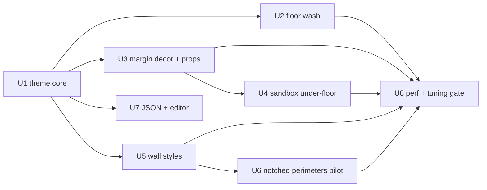

# feat: Zone-theme visual overhaul

## Summary

Implement the zone-theme system by extending existing modules rather than introducing a new framework: floor washes join `src/lib/arena-bg.ts`, wall trim bakes inside the existing wall layer in `src/lib/walls.ts`, and a new `src/lib/theme-decor.ts` module mirrors the margin-clip pattern of `src/lib/background-energy.ts` for self-luminous parallax decor. One new theme registry module plus surgical edits to the three render pipelines, mirrored 1-to-1 across rooms / tutorial / sandbox. Infected sector ships first as the showcase.

---

## Problem Frame

The game reads as bare walls on a dark floor; the approved requirements doc defines a four-element visual overhaul (colored floor, parallax decor, decorated walls, irregular silhouettes) with the AI-generated reference image `docs/brainstorms/visual-overhaul-reference.jpg` as the visual bar. This plan resolves the five questions the brainstorm deferred to planning and turns the system into dependency-ordered implementation units. (See origin for full product framing.)

---

## Requirements

Traced to origin (see origin: docs/brainstorms/visual-overhaul-zone-themes-requirements.md):

- R1. One shared theming system serves all three modes; a room selects a zone theme (floor wash palette, margin decor set, wall style, accents).
- R2. Theme API carries an intensity parameter 0..1 from v1, statically set per room; rendered result at default matches the approved look.
- R3. Infected sector zone ships first, matching the reference image's red-purple mood; other zones get their own identities.
- R4. Per-zone gradient floor wash replaces flat darkness; dimmer than the reference; hue separated from bullet colors.
- R5. Wireframe decor (hexes, circuit fragments, data blocks, eyes — lore vocabulary) in multiple depth layers with camera parallax beyond the arena.
- R6. Sandbox (full-viewport arena) renders decor as a dim under-floor layer beneath the grid.
- R7. Decor is self-luminous and visible through the campaign darkness overlay.
- R8. Walls: dark body + bright neon edge trim + panel lines / corner markers / hazard accents per zone wall style.
- R9. Emissive decorative props inside arenas (rosettes, trimmed pylons, glowing details).
- R10. Irregular (notched/stepped) arena perimeters composed from existing rectangular wall blocks; collision unchanged.
- R11. Threat readability beats juice on every conflict; decor brightness/alpha capped; zone hues tuned away from threat colors.
- R12. 60 fps holds; baked sprites, no per-frame shadowBlur on recurring elements, pooled objects; F2 perf overlay is the acceptance gate.

**Origin acceptance examples:** AE1 (intensity scales theme energy; covers R2), AE2 (decor visible through darkness; covers R7), AE3 (sandbox under-floor decor; covers R6), AE4 (bullets distinguishable over floor wash; covers R4, R11), AE5 (notched corners collide exactly like rectangular walls; covers R10).

---

## Scope Boundaries

- No music synchronization or audio-driven visuals; intensity wiring to live gameplay signals (multiplier, aggro, boss phases) is a later iteration — v1 only ships the parameter.
- No landing-page or DOM-overlay redesign.
- No non-AABB collision geometry.
- No per-room hand-authored art; uniqueness = theme + layout.
- No GD asset copying; decor vocabulary from VECTRIX lore only.
- No gameplay, enemy, scoring, or balance changes.
- Gameplay-semantic colors are exempt from theming: dashable-wall cyan dash language, door lock gold, infected-wall red, dash-flash cyan (`PALETTE.playerDash`).
- No test framework introduction — the repo has none; gates remain `tsc --noEmit` / `pnpm build`, visual checks via `pnpm dev`, and the F2 perf overlay.
- Editor gets a theme field but no intensity slider in v1 (intensity lives in code, per origin AE1).

### Deferred to Follow-Up Work

- `prefers-reduced-motion` support for game canvases (landing already handles it; parallax makes the gap more visible) — separate small pass after the overhaul lands.
- Re-enabling the zeroed `src/lib/postprocess.ts` bloom as an optional juice knob — evaluate only after U8 profiling.
- Retiring or reworking `src/lib/background-energy.ts` / `src/lib/background-text.ts` — they stay as-is in this plan (kept dimmed under darkness, new decor draws above).
- Cleanup of unregistered `src/rooms/room2.ts` / `room3.ts` / `room4.ts` files — untouched.
- Wiring intensity to gameplay signals ("living system" reactivity from origin Key Decisions).
- First `docs/solutions/` capture via `ce-compound` after this lands (the directory currently has zero entries).

---

## Context & Research

### Relevant Code and Patterns

- `src/lib/bg-fx.ts` — `drawBack()` is an intentionally-kept no-op slot in all three renders, positioned "behind everything except the bg fill"; a pre-blessed insertion point.
- `src/lib/background-energy.ts` — canonical margin-layer mechanism: per-frame `ArenaScreenBounds`, two-rect even-odd clip (viewport minus arena), early return when arena covers viewport, `shadowBlur` once per pass. The decor module mirrors this clip but NOT the early return (sandbox uses the under-floor branch instead).
- `src/lib/arena-bg.ts` — per-room world-space background with a lazily baked light sprite; the floor wash extends this module.
- `src/lib/walls.ts` — `WallStyle` (currently module-private; normal + infected), three-group batched painting, whole-room layer baked into an offscreen canvas via a `WeakMap` keyed on the walls array. Trim/panels go inside this bake.
- `src/landing/menu-bg.ts` — seeded persistent decorative fixtures and wireframe shape lifecycle (currently behind a disabled flag); the decor vocabulary and seeding approach lift from here.
- Boss glow in `src/rooms/rooms-game.ts` — baked sprite blitted after the darkness overlay; the existing precedent for "self-luminous through darkness".
- Sprite-bake convention: lazy module-level cache keyed by visual params, paint once with shadowBlur, blit with `drawImage`; fake glow for dynamic strokes = wide-dim + bright-thin stroke pair.
- `src/lib/perf-meter.ts` — closed `SECTIONS` tuple; new render passes need entries to be measurable (only rooms-game is instrumented).
- Room config precedent: optional per-room config objects on the `Room` type in `src/lib/room.ts` (`heartMechanic`, `sleepingChamber`) — the `theme` field follows this pattern.
- JSON room pipeline: `src/rooms/room-json-types.ts`, `src/rooms/validate-room-json.ts`, `src/rooms/build-room-from-json.ts`, plus the level editor.

### Institutional Learnings

- LESSONS.md #1 / HANDOVER.md #3: partial render-pipeline ports cost six iterations once. This plan names exact insertion points per mode (High-Level Technical Design) and requires 1-to-1 mirroring into `src/tutorial/tutorial-game.ts`.
- HANDOVER.md #1: a perf fix once shipped without F2 confirmation and didn't help. Layer counts and alpha budgets are locked from F2 measurement (U8), not guesses.
- ARCHITECTURE.md performance architecture + Pulsing Heart ring-accumulation bug: decor lifecycle gets hard caps on live entity counts.
- HANDOVER.md #4/#5: tag a checkpoint before multi-module passes (`pre-visual-overhaul`); `perf-pass-stable` is the perf baseline to regress against. Canvas 2D is the committed renderer — no framework detours.
- ARCHITECTURE.md drift found by research (do not trust doc claims in these areas): darkness is visR 600 / alpha 0.45 uniform dusk (not a 270 px mask), `useCamera` is inert, `Room` type lives in `src/lib/room.ts`, flicker state is vestigial.

### External References

- None — local patterns are strong; external research skipped deliberately.

---

## Key Technical Decisions

- **Extend, don't replace**: floor wash inside `arena-bg`, wall trim inside the `walls.ts` bake, decor as one new module mirroring `background-energy`'s clip. Rationale: every target module already solved the hard sub-problem (per-room state, margin clip, layer bake).
- **Theme as a registry module + optional `theme` field on `Room` and Room JSON, with a default-theme fallback**; sandbox and tutorial select their theme in code at `start()`. Rationale: follows the existing optional-room-config pattern; legacy JSON rooms keep working.
- **Darkness becomes a room/theme property**, replacing the hardcoded room-id set in rooms-game. Rationale: the theme system touches this code anyway; removes the third ad-hoc per-room flag mechanism.
- **Margin decor draws after the darkness overlay** (boss-glow precedent) so it glows through (R7); existing energy/text layers stay where they are, dimmed under darkness. Rationale: cheapest correct layering; avoids reworking two stable modules.
- **Mode-static placement branch**: margins-mode in rooms/tutorial (even when a margin is zero-width on a given frame), under-floor-mode in sandbox. Rationale: prevents resize/camera-driven mode flapping.
- **Sandbox grid bake goes transparent** (grid lines only, no opaque bg fill) so the under-floor stack (wash → decor → grid) is actually visible. Rationale: the current opaque bake would hide everything beneath it.
- **Decor lifecycle is per-room**: recreated in `syncRoomFx()` on transition/restart/teleport, hard swap with no crossfade; dt-driven so it freezes under pause/dev-menu. Seeded fixtures use room/viewport-relative coordinates so resize doesn't dogpile or vacate decor.
- **Wall-layer cache key extends with the theme id** (in addition to the existing array identity + wall count); all trim/panel details are baked, animated accents stay in the existing `drawWallOverlay` live pass.
- **Floor wash bakes at reduced resolution** and stretches at blit (gradients scale cleanly) so 3600–8000 px corridors don't allocate multi-megapixel canvases; sandbox wash is keyed to viewport size and rebuilt on resize.
- **Notched perimeters are an authoring convention, not an engine change**: flush AABB blocks with merge flags; ambient-bullet spawn areas must lie inside the silhouette (validator check added for JSON rooms).
- **In-arena emissive props are non-colliding world-space decor** (part of the theme-decor module, drawn between grid and walls), not wall blocks. Rationale: props must never change gameplay collision (origin scope boundary).

---

## Open Questions

### Resolved During Planning

- Sandbox under-floor visibility: resolved — transparent grid bake + alpha-capped under-floor layer (flow analysis found the current bake is opaque and would hide it).
- Theme source of truth: resolved — `theme` field on `Room` + optional JSON field with validator + code fallback; sandbox/tutorial hardcode in their `start()`.
- Energy/text margin layers vs darkness: resolved — keep both as-is, dimmed; new decor draws above darkness.
- Decor lifecycle: resolved — per-room recreate, hard swap, dt-driven.
- Darkness gating: resolved — room/theme property replaces the id set.

### Deferred to Implementation

- Exact alpha budgets, layer counts, and per-zone decor density: locked from F2 measurement and eyeball checks in U8 — committing numbers now would repeat the "perf fix without measurement" failure.
- Exact zone palettes beyond infected (proposed defaults below in U1): confirmed visually during implementation; generated mockups optional.
- Whether the wash benefits from a subtle slow hue drift within a zone: try during U2 tuning; cut if it fights readability.

---

## High-Level Technical Design

> *This illustrates the intended approach and is directional guidance for review, not implementation specification. The implementing agent should treat it as context, not code to reproduce.*

**Per-mode render-order insertion map** (the load-bearing artifact per LESSONS.md #1 — every `[NEW]` must land in all listed modes, 1-to-1):

Rooms (`src/rooms/rooms-game.ts`) and Tutorial (`src/tutorial/tutorial-game.ts`, mirror exactly):

1. bg fill → `bgFx.drawBack` → energy → bgtext *(unchanged)*
2. camera transform begins
3. `drawArenaBg` **[MOD: theme floor wash baked into the arena-bg pass]**
4. grid → archive-fx → **[NEW: in-arena emissive props, world-space, culled]** → walls **[MOD: theme wall style in bake]** → wallOverlay → … entities … → camera restore
5. darkness overlay *(gating becomes room/theme property)*
6. boss glow → **[NEW: margin parallax decor, screen-space, even-odd clip outside arena rect]** → room message → `bgFx.drawFront` → flashes/vignettes → HUD → scanlines *(unchanged order otherwise)*

Tutorial has no darkness overlay or boss glow — the margin decor pass slots at the same relative position (after camera restore, before `drawFront`).

Sandbox (`src/sandbox/sandbox-game.ts`):

1. bg fill → `drawArenaBg` **[MOD: wash]** → `bgFx.drawBack` → energy/bgtext (short-circuit, unchanged) → **[NEW: under-floor decor, dim]** → grid blit **[MOD: transparent bake]** → border → entities → … → scanlines

Theme data flow: room factory / JSON / mode `start()` names a theme id → resolved against the registry in `src/lib/zone-theme.ts` → `syncRoomFx()` (rooms/tutorial) or `start()`/`resize()` (sandbox) hands the resolved theme to arena-bg, theme-decor, and the walls bake. Intensity is a field on the resolved theme state read by each consumer.

Unit dependency graph:

---

## Implementation Units

> Verification convention for all units: the repo has no test infrastructure. "Test scenarios" below are manual visual/behavioral checks run via `pnpm dev`, plus `npx tsc --noEmit` as the type gate. Tag `pre-visual-overhaul` before starting U1.

### U1. Zone theme registry and mode plumbing

**Goal:** A theme registry exists, every room/mode resolves a theme, and darkness becomes a declared property instead of a hardcoded id set.

**Requirements:** R1, R2, R3 (partial — defines the infected identity)

**Dependencies:** None

**Files:**
- Create: `src/lib/zone-theme.ts`
- Modify: `src/lib/room.ts`, `src/rooms/rooms-game.ts`, `src/tutorial/tutorial-game.ts`, `src/sandbox/sandbox-game.ts`, `src/lib/palette.ts`, room factories (`src/rooms/room1.ts`, `src/rooms/infected-hub.ts`, `src/rooms/infected-hub-top.ts`, `src/rooms/infected-hub-bottom.ts`, `src/rooms/room5.ts`)

**Approach:**
- Theme type: id, floor wash colors, margin decor set descriptor, wall style id, accent colors, darkness flag, default intensity. Registry maps theme ids to definitions; resolution falls back to a default theme when a room declares none.
- Proposed zone identities (tunable defaults, confirmed visually later): `infected` red-purple (reference image), `corridor` cyan-slate, `boss` deep crimson, `sandbox` neutral cyan, `tutorial` calm slate.
- Replace the darkness room-id set in rooms-game with the resolved theme/room property; the flicker remnants stay untouched (vestigial, out of scope).
- New accent colors land in `src/lib/palette.ts` per house rule.
- Theme resolution happens in `syncRoomFx()` (rooms/tutorial) and `start()` (sandbox); resolved theme state (including intensity) is held alongside the other per-room FX state.

**Patterns to follow:** optional room-config objects (`heartMechanic` on `Room`); `PALETTE as const`.

**Test scenarios:**
- Happy path: every campaign room, tutorial room, and sandbox boots with a resolved theme; rooms with no declared theme get the default. Verified by a temporary debug log or HUD label during dev.
- Edge case: dev-menu (F1) teleport between rooms with different themes re-resolves cleanly; restart re-resolves the same theme.
- Happy path: darkness still applies in exactly the rooms that had it before (room1, hub trio, room5) — now via the property.
- `npx tsc --noEmit` passes.

**Verification:** Theme state observable per room; darkness parity with current behavior; no visual change otherwise yet.

---

### U2. Floor color wash in arena-bg

**Goal:** The arena floor reads as a per-zone gradient color wash instead of flat darkness, in all three modes.

**Requirements:** R4, R2; AE4 (initial pass)

**Dependencies:** U1

**Files:**
- Modify: `src/lib/arena-bg.ts`, `src/rooms/rooms-game.ts`, `src/tutorial/tutorial-game.ts`, `src/sandbox/sandbox-game.ts` (pass theme into arena-bg creation)

**Approach:**
- Wash is a baked gradient sprite layered into the existing arena-bg draw (beneath the dot field), keyed by theme + room size; baked at reduced resolution and stretched at blit so big corridors stay cheap.
- Intensity scales wash alpha. Hue is taken from the theme, pre-tuned away from `PALETTE.bullet` red — for the infected zone this means leaning purple over red.
- Sandbox wash keys to viewport size and rebuilds inside the existing `resize()` path.

**Patterns to follow:** `buildLightSprite` lazy bake in `arena-bg.ts`.

**Test scenarios:**
- Covers AE4. Happy path: in the infected hub with max ambient bullets, red bullets stay readable at a glance over the wash (eyeball check at normal play distance).
- Happy path: each zone shows its own wash identity; sandbox shows the neutral wash.
- Edge case: 3600×600 corridor and 1600×1200 boss arena both render the wash without seams or obvious low-res banding; window resize in sandbox rebuilds the wash without artifacts.
- Edge case: wash at intensity 0 vs default visibly differs (covers AE1 partially).

**Verification:** Floor no longer reads as flat darkness in any mode; F2 `arenabg` section shows no regression spike.

---

### U3. Margin parallax decor module + in-arena props

**Goal:** Self-luminous wireframe decor fills the margins beyond the arena with camera parallax, plus sparse emissive props inside arenas; visible through campaign darkness.

**Requirements:** R5, R7, R9, R2; AE2

**Dependencies:** U1

**Files:**
- Create: `src/lib/theme-decor.ts`
- Modify: `src/rooms/rooms-game.ts`, `src/tutorial/tutorial-game.ts` (insertion per the design map), `src/lib/perf-meter.ts` (new `decor` section)

**Approach:**
- State module shape (`create / update / draw`), recreated per room in `syncRoomFx()`. Seeded fixtures (menu-bg style): per theme, a set of silhouette types — hex clusters, circuit fragments, data blocks, eye motifs — in 2–3 depth layers; each silhouette baked into a sprite at seed time; per-layer parallax factor applied from camera position.
- Margin pass draws in screen space after the darkness overlay (rooms) / at the same relative slot (tutorial), clipped to viewport-minus-arena via the even-odd pattern from `background-energy.ts`. No early return on zero margins — rooms mode is margins-mode statically.
- In-arena props: a sparse world-space sub-layer (drawn between grid and walls, camera-culled) using the same baked-sprite vocabulary, dimmer; non-colliding by construction.
- Hard caps on live silhouette/prop counts per layer (Pulsing Heart accumulation lesson); dt-driven animation only (freezes under pause).
- Intensity scales decor alpha and animation activity.

**Patterns to follow:** `background-energy.ts` even-odd clip; `menu-bg.ts` seeded fixtures + shape lifecycle; boss-glow draw-after-darkness precedent; rooms-game cull rect for world-space loops.

**Test scenarios:**
- Covers AE2. Happy path: in dark campaign rooms, margin decor reads as glowing silhouettes through the darkness; in the camera corridor (room1), top/bottom bands show decor scrolling with parallax.
- Happy path: tutorial shows the same decor behavior (1-to-1 mirror) with its calm theme.
- Edge case: window aspect with zero side margins (arena fills width) — no clip artifacts, decor simply not visible there that frame.
- Edge case: room transition / teleport / restart hard-swaps decor without leftovers from the previous theme.
- Edge case: pause and dev-menu freeze decor motion.
- Error path: silhouette counts never exceed their caps during a long idle session (observe F2 + visual).

**Verification:** Margins no longer read as dead black; F2 `decor` section stays green in normal play.

---

### U4. Sandbox under-floor decor branch

**Goal:** Sandbox gets the depth effect as a dim under-floor layer beneath a now-transparent grid.

**Requirements:** R6, R2; AE3

**Dependencies:** U1, U3

**Files:**
- Modify: `src/sandbox/sandbox-game.ts`, `src/lib/grid.ts` (transparent grid bake — lines only, no opaque bg fill)

**Approach:**
- Under-floor variant of the theme-decor module: same vocabulary, slow drift instead of camera parallax (sandbox has no camera), alpha hard-capped well below margin levels, drawn between the wash and the grid blit.
- Reseed with the grid on `resize()`.
- Confirm the existing layers that were previously buried under the opaque grid bake (`drawArenaBg`, `bgFx.drawBack`) now composite as intended — this changes sandbox's effective stack and needs an explicit before/after eyeball pass.

**Patterns to follow:** the existing sandbox `resize()` rebuild path; U3's module API.

**Test scenarios:**
- Covers AE3. Happy path: starting a sandbox run shows dim decor under the grid instead of flat dark.
- Covers AE4. Happy path: at max bullets + a 10× multiplier run, threats remain unmistakably the brightest layer (eyeball).
- Edge case: fullscreen toggle / window resize reseeds without dogpiling or vacating decor; tiny window stays sane.
- Edge case: grid lines render identically to today against the new stack (no halo/AA artifacts from transparency).

**Verification:** Sandbox depth effect present; readability check passes; no FPS regression at max bullets (F2 not instrumented in sandbox — use the FPS counter).

---

### U5. Themed wall styles: trim, panels, markers

**Goal:** Walls stop being bare rectangles — dark body, bright neon edge trim, panel lines and corner/hazard details, styled per zone, fully baked.

**Requirements:** R8, R2

**Dependencies:** U1

**Files:**
- Modify: `src/lib/walls.ts`, plus every `drawWalls`/bake call site if the signature grows: `src/rooms/rooms-game.ts`, `src/tutorial/tutorial-game.ts`, and the editor canvas module

**Approach:**
- Export and extend the wall style mechanism: theme supplies a wall style (body fill, trim color/width, panel line treatment, marker accents). The per-wall `infected` flag keeps working (semantic override).
- All new detail paints inside the existing whole-room bake; cache key extends with the theme id (current key: walls array identity + count). Trim glow uses the fake-glow two-stroke pattern, not shadowBlur, inside the bake where shadowBlur is also acceptable since it's a one-time paint.
- Animated accents (existing marching dashes, pulses) remain in `drawWallOverlay` untouched.
- Semantic exemptions honored: dashable cyan dash language, door visuals, infected red identity.

**Execution note:** Tutorial Room 0 mutates its walls array mid-room (dash gate splice) — verify the cache invalidation path against theme-keyed entries before styling work, since this is the known mutation case.

**Patterns to follow:** existing `paintWalls` group batching; fake-glow ring pattern in rooms-game.

**Test scenarios:**
- Happy path: infected hub walls show red-purple body + bright trim + details matching the reference mood; corridor walls show the cyan style; the same room screenshot before/after reads as "decorated", not "bare".
- Edge case: merged multi-segment perimeter walls (room1's three-segment top wall) show continuous trim with no seams or double-stroked joints.
- Edge case: tutorial Room 0 dash-gate wall removal mid-room rebuilds the layer correctly with the themed style.
- Edge case: dashable walls keep their cyan dashed identity in every theme.
- Integration: editor canvas renders themed walls without stale-cache artifacts when switching rooms.

**Verification:** Wall bake remains one blit per frame (F2 `walls` section flat); visual parity with reference language.

---

### U6. Irregular perimeter pilot: infected hub + boss arena

**Goal:** The infected hub and Room 5 get notched/stepped silhouettes composed from flush AABB blocks, proving the authoring pattern.

**Requirements:** R10; AE5

**Dependencies:** U5

**Files:**
- Modify: `src/rooms/infected-hub.ts`, `src/rooms/room5.ts`

**Approach:**
- Re-author perimeters as flush rectangular segments with merge flags suppressing internal seams (the room1 multi-segment perimeter is the model). Door and exit placements stay functionally where they are.
- Authoring rule established here and documented in the room files: ambient-bullet spawn areas must lie fully inside the irregular silhouette; notch voids must be tiled by wall blocks so no un-themed floor leaks.
- Keep changes layout-only: enemy positions, mechanics, and pacing untouched.

**Patterns to follow:** `room1.ts` named-constant flush perimeter segments with merge flags; "coordinates of touching edges must match exactly".

**Test scenarios:**
- Covers AE5. Happy path: dashing into a notch corner triggers the normal smash effect; sliding along stepped edges never snags or clips.
- Happy path: ambient bullets in the hub never spawn inside wall blocks or outside the silhouette (observe extended play).
- Edge case: Watcher LOS raycasts and the heart-room pulse mechanics behave as before (walls list is what changed; logic consumes it generically).
- Edge case: hub key/door flows (2-key east door, top/bottom exits) work unchanged.

**Verification:** Both rooms read as shaped spaces per the reference; zero gameplay regressions in a full hub → boss run.

---

### U7. Theme field in JSON rooms and the level editor

**Goal:** JSON-defined rooms can declare a theme; the editor exposes it; legacy JSON keeps working.

**Requirements:** R1

**Dependencies:** U1

**Files:**
- Modify: `src/rooms/room-json-types.ts`, `src/rooms/validate-room-json.ts`, `src/rooms/build-room-from-json.ts`, editor UI module(s)

**Approach:**
- Optional theme id field; validator accepts known theme ids and rejects unknown ones with a clear message; absent field → default theme (same fallback as code rooms).
- Editor: a simple theme selector (no intensity control in v1 per origin AE1).
- Validator additionally warns when an ambient spawn area falls outside the wall-enclosed region (the U6 authoring rule, automated for JSON rooms where cheap to check; otherwise document as convention).

**Patterns to follow:** existing optional fields in `RoomJson.WallSpec` mirroring `Wall` flags.

**Test scenarios:**
- Happy path: a JSON room with a declared theme renders with it; the legacy room JSON (no field) renders with the default theme.
- Error path: unknown theme id fails validation with an actionable message.
- Integration: editing a room in the level editor and switching its theme updates the preview (wall bake invalidates per U5's theme-keyed cache).

**Verification:** Round-trip: edit → save → load → render with the chosen theme.

---

### U8. Perf gate and readability tuning pass

**Goal:** Lock layer counts, alpha budgets, and zone palettes from measurement; prove 60 fps and threat readability in the heaviest scenes.

**Requirements:** R11, R12, R3 (palette confirmation); AE1, AE4 final pass

**Dependencies:** U2, U3, U4, U5, U6

**Files:**
- Modify: `src/lib/theme-decor.ts`, `src/lib/zone-theme.ts`, `src/lib/arena-bg.ts` (tuning constants only); possibly `src/lib/perf-meter.ts` if section granularity needs splitting

**Approach:**
- Profile with F2 in the worst case: boss phase 3 (mines + attacks + max particles) and the noisy hub variant; compare against the `perf-pass-stable` baseline feel.
- Tune decor layer counts, sprite sizes, alpha budgets, and wash intensity per zone; confirm final zone palettes visually (generate mockups only if a palette is contested).
- Final readability sweep per AE4 across every zone at max threat density; final AE1 check that intensity 0 → 1 visibly scales the whole theme.

**Test scenarios:**
- Covers AE1. Happy path: setting intensity to 0 / 0.5 / 1 in code visibly scales wash + decor energy with no other changes.
- Covers AE4. Happy path: max-threat scenes in every zone keep bullets/enemies as the unambiguous brightest layer.
- Error path: if any F2 section goes amber/red in the boss fight, reduce that pass's budget until green — readability and 60 fps win over juice by R11/R12.

**Verification:** F2 green in boss phase 3 and noisy hub; before/after screenshots of hub, corridor, boss, sandbox, tutorial captured for the record.

---

## System-Wide Impact

- **Interaction graph:** three render pipelines gain passes; `syncRoomFx()` gains theme resolution; walls bake gains a cache dimension consumed by rooms, tutorial, and the editor canvas.
- **State lifecycle risks:** per-room decor must fully reset on transition/restart/teleport (hard swap); sandbox reseeds on resize; theme-keyed wall-layer cache must invalidate on theme change and survive the tutorial Room 0 mid-room wall mutation.
- **API surface parity:** any `drawWalls`/bake signature change must land in every call site in the same unit — rooms-game, tutorial-game (manual fork mirror), editor canvas.
- **Integration coverage:** darkness overlay ordering (decor above, energy/text below) is only provable by eyeball in dark rooms — explicitly checked in U3.
- **Unchanged invariants:** collision (`resolveEntityWallCollisions` AABB), enemy logic, scoring, pickups, audio, localStorage keys, and the HUD are untouched. `background-energy` / `background-text` / `bg-fx` keep their current behavior and positions.

---

## Risk Analysis & Mitigation

| Risk | Likelihood | Impact | Mitigation |
|------|-----------|--------|------------|
| Decor/wash erodes threat readability in real play | Med | High | R11 rule enforced per unit (AE4 checks in U2/U4/U8); hue separation designed in at U1; final sweep in U8 |
| FPS regression in boss phase 3 | Med | High | All recurring paint baked; per-pass F2 sections; U8 measurement gate; budgets reducible per zone |
| Partial pipeline mirror into tutorial fork (repeats the 6-iteration failure) | Med | Med | Insertion map in this plan; tutorial files listed in every relevant unit; U3/U5 test scenarios include tutorial checks |
| Wall-cache invalidation bugs (theme key × mid-room mutation) | Low | Med | U5 execution note targets the known mutation case first |
| Notched layouts break ambient spawns or LOS mechanics | Low | Med | U6 authoring rule + extended-play checks; U7 validator warning |
| Scope creep into reactivity/music/postprocess | Med | Low | Explicit scope boundaries; intensity stays static in v1 |

---

## Phased Delivery

### Phase 1 — Infected showcase (U1 → U2 → U3)
Theme core, floor wash, margin decor. After this phase the infected hub already reads as the reference image's world; campaign is the visible proof.

### Phase 2 — Full coverage (U4, U5)
Sandbox under-floor branch and themed walls everywhere. After this phase no mode has bare walls.

### Phase 3 — Shape, tooling, gate (U6, U7, U8)
Notched perimeters pilot, JSON/editor support, measurement-driven tuning and the final readability/perf gate.

---

## Documentation / Operational Notes

- Tag `pre-visual-overhaul` before U1; rollback is a hard reset to that tag (ARCHITECTURE.md working rule).
- Update ARCHITECTURE.md's architecture notes after landing (theme module, darkness property, transparent sandbox grid) — research found existing drift; don't add more.
- Strong candidate for the repo's first `docs/solutions/` capture via `ce-compound` after completion.

---

## Sources & References

- **Origin document:** [docs/brainstorms/visual-overhaul-zone-themes-requirements.md](../brainstorms/visual-overhaul-zone-themes-requirements.md)
- Visual reference: `docs/brainstorms/visual-overhaul-reference.jpg`
- Related code: `src/lib/arena-bg.ts`, `src/lib/walls.ts`, `src/lib/background-energy.ts`, `src/landing/menu-bg.ts`, `src/lib/zone-theme.ts` (new), `src/lib/theme-decor.ts` (new)
- Institutional sources: `LESSONS.md`, `HANDOVER.md`, ARCHITECTURE.md "Performance architecture"
